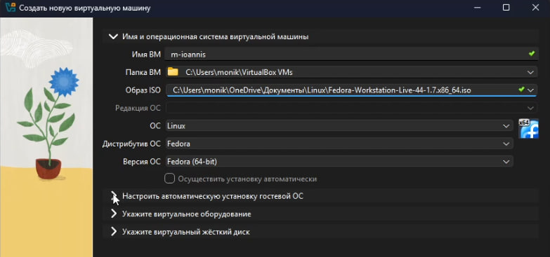
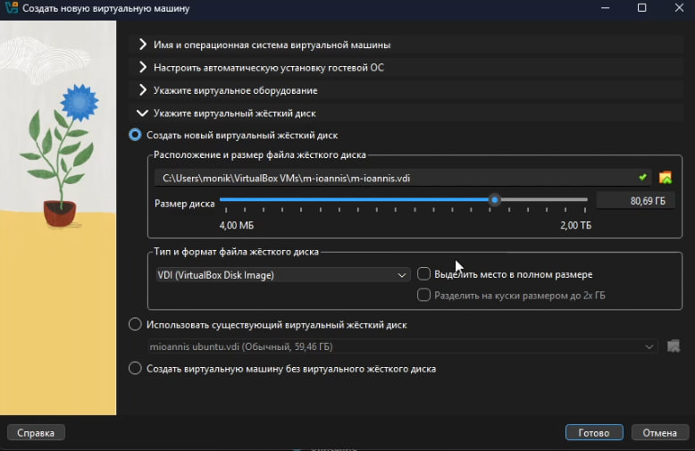
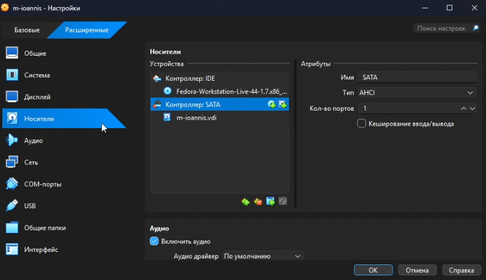
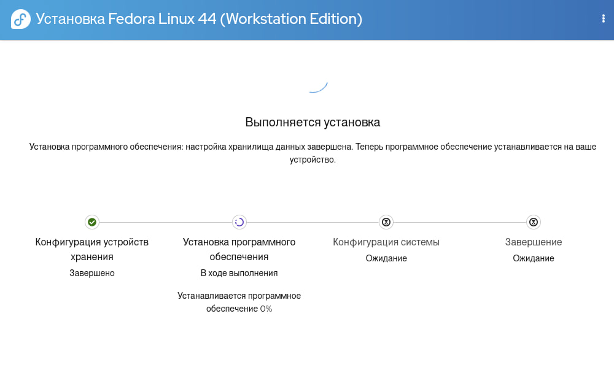
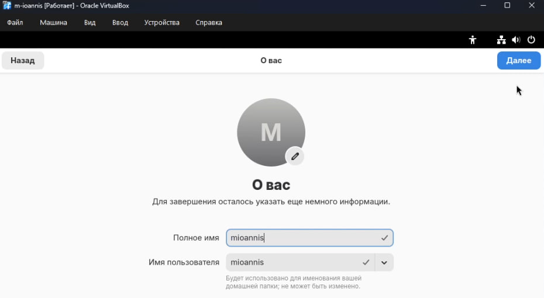
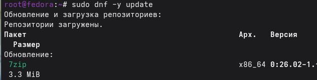
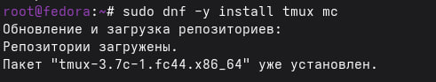
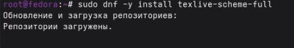
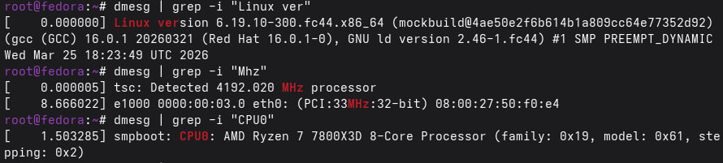
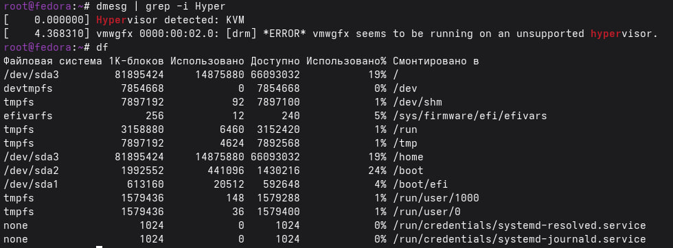

---
## Author
author: 
  name: Магос Иоаннис
  email: 1032240004@rudn.ru
  affiliation:
    - name: Российский университет дружбы народов
      country: Российская Федерация
      postal-code: 117198
      city: Москва
      address: ул. Миклухо-Маклая, д. 6
	  
## Title
title: Операционные системы
subtitle: Установка ОС на виртуальную машину
license: CC BY
date: today
date-format: "YYYY-MM-DD"
---

# Цели и задачи работы

## Цель лабораторной работы

Целью данной работы является приобретение практических навыков установки операционной системы на виртуальную машину, настройки минимально необходимых для дальнейшей работы сервисов.

# Процесс выполнения лабораторной работы

## 1. Создаем виртуальную машину

{ #fig:001 width=70% }

## 2. Задаём конфигурацию жёсткого диска — VDI.

{ #fig:002 width=70% }

{ #fig:003 width=70% }

## 3. Добавляю новый привод оптических дисков и выбираю образ

{ #fig:003 width=70% }

{ #fig:004 width=70% }

## 4. Запускаю виртуальную машину и выбираю установку системы на жёсткий диск.
Устанавливаю язык для интерфейса и раскладки клавиатуры

{ #fig:005 width=70% }

## 5. Параметры системы при установке 

{ #fig:006 width=70% }

## 6. Процесс установки

{ #fig:007 width=70% }

## 7. Процесс создания пользователя

{ #fig:008 width=70% }

## 8. Устанавливаю средства разработки

{ #fig:009 width=70% }

## 9. Обновляю пакеты

{ #fig:010 width=70% }

## 10. Установил программу для удобства работы в консоли

{ #fig:011 width=70% }

## 11. Установил Pandoc и pandoc-crossref

{ #fig:012 width=70% }

{ #fig:013 width=70% }

## 12. Установим дистрибутив TeXlive

{ #fig:014 width=70% }

## 13. Вопросы из домашнего задания

{ #fig:015 width=70% }

{ #fig:016 width=70% }

# Выводы по проделанной работе

# Вывод

Мы приобрели практические навыки установки операционной системы на виртуальную машину, настройки минимально необходимых для дальнейшей работы сервисов.