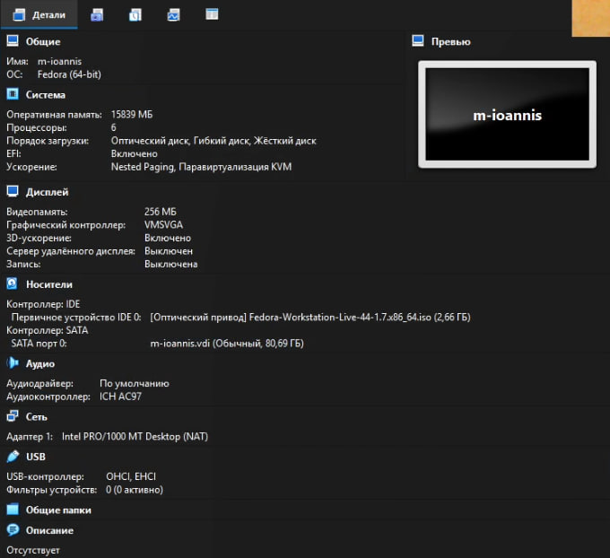
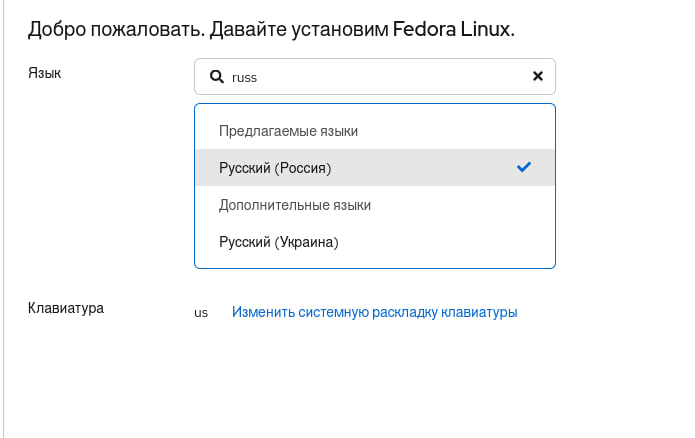
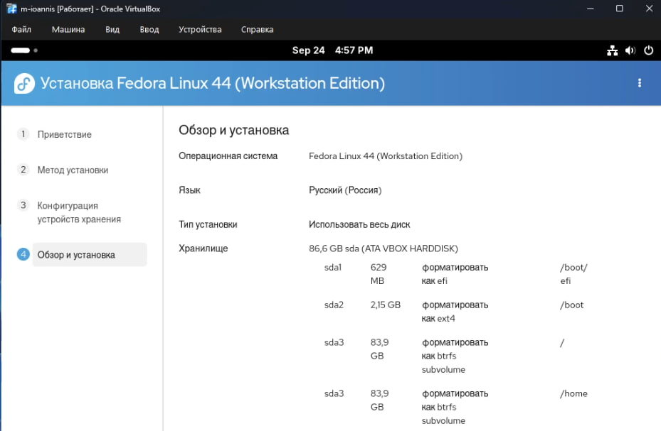
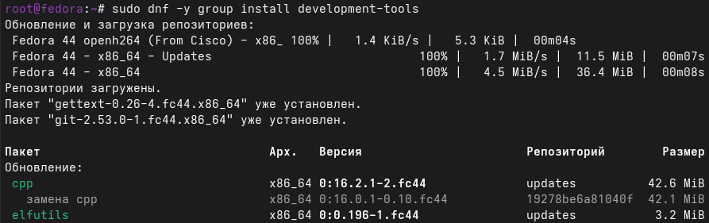
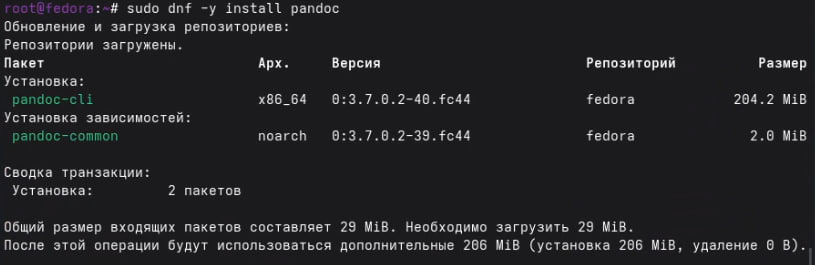
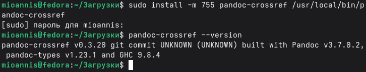

# Цель работы

Целью данной работы является приобретение практических навыков установки операционной системы на виртуальную машину, настройки минимально необходимых для дальнейшей работы сервисов.

# Выполнение лабораторной работы

1. Создаем виртуальную машину

{ #fig:001 width=70% }

2. Задаём конфигурацию жёсткого диска — VDI.

{ #fig:002 width=70% }

{ #fig:003 width=70% }

3. Добавляю новый привод оптических дисков и выбираю образ

{ #fig:003 width=70% }

{ #fig:004 width=70% }

4. Запускаю виртуальную машину и выбираю установку системы на жёсткий диск.
Устанавливаю язык для интерфейса и раскладки клавиатуры

{ #fig:005 width=70% }

5. Параметры системы при установке 

{ #fig:006 width=70% }

6. Процесс установки

{ #fig:007 width=70% }

7. Процесс создания пользователя

{ #fig:008 width=70% }

8. Устанавливаю средства разработки

{ #fig:009 width=70% }

9. Обновляю пакеты

{ #fig:010 width=70% }

10. Установил программу для удобства работы в консоли

{ #fig:011 width=70% }

11. Установил Pandoc и pandoc-crossref

{ #fig:012 width=70% }

{ #fig:013 width=70% }

12. Установим дистрибутив TeXlive

[Это заняло много времени](image/14.jpg){ #fig:014 width=70% }

13. Вопросы из домашнего задания

{ #fig:015 width=70% }

{ #fig:016 width=70% }

# Вывод

Мы приобрели практические навыки установки операционной системы на виртуальную машину, настройки минимально необходимых для дальнейшей работы сервисов.

# Контрольные вопросы

1. Какую информацию содержит учётная запись пользователя?

* входное имя пользователя (Login Name);
* пароль (Password);
* внутренний идентификатор пользователя (User ID);
* идентификатор группы (Group ID);
* анкетные данные пользователя (General Information);
* домашний каталог (Home Dir);
* указатель на программную оболочку (Shell).

2. Укажите команды терминала и приведите примеры:

* для получения справки по команде - man;
* для перемещения по файловой системе - cd;
* для просмотра содержимого каталога - ls;
* для определения объёма каталога - ls -l;
* для создания / удаления каталогов / файлов - touch, mkdir, rm, rmdir;
* для задания определённых прав на файл / каталог - chmod;
* для просмотра истории команд - history.

3. Что такое файловая система? Приведите примеры с краткой характеристикой.

Файловая система (англ. file system) — порядок, определяющий способ организации, хранения и именования данных на носителях информации в компьютерах, а также в другом электронном оборудовании.

FAT. Числа в FAT12, FAT16 и FAT32 обозначают количество бит, используемых для перечисления блока файловой системы. FAT32 является фактическим стандартом и устанавливается на большинстве видов сменных носителей по умолчанию. Одной из особенностей этой версии ФС является возможность применения не только на современных моделях компьютеров, но и в устаревших устройствах и консолях, снабженных разъемом USB.
Пространство FAT32 логически разделено на три сопредельные области: зарезервированный сектор для служебных структур; табличная форма указателей; непосредственная зона записи содержимого файлов. 

Стандарт NTFS разработан с целью устранения недостатков, присущих более ранним версиям ФС. Впервые он был реализован в Windows NT в 1995 году, и в настоящее время является основной файловой системой для Windows. Система NTFS расширила допустимый предел размера файлов до шестнадцати гигабайт, поддерживает разделы диска до 16 Эб (эксабайт, 1018 байт). Использование системы шифрования Encryption File System (метод «прозрачного шифрования») осуществляет разграничение доступа к данным для различных пользователей, предотвращает несанкционированный доступ к содержимому файла. Файловая система позволяет использовать расширенные имена файлов, включая поддержку многоязычности в стандарте юникода UTF, в том числе в формате кириллицы. Встроенное приложение проверки жесткого диска или внешнего накопителя на ошибки файловой системы chkdsk повышает надежность работы харда, но отрицательно влияет на производительность.

Ext2, Ext3, Ext4 или Extended Filesystem– стандартная файловая система, первоначально разработанная еще для Minix. Содержит максимальное количество функций и является наиболее стабильной в связи с редкими изменениями кодовой базы. Начиная с ext3 в системе используется функция журналирования. Сегодня версия ext4 присутствует во всех дистрибутивах Linux. 

XFS рассчитана на файлы большого размера, поддерживает диски до 2 терабайт. Преимуществом системы является высокая скорость работы с большими файлами, отложенное выделение места, увеличение разделов на лету, незначительный размер служебной информации. К недостаткам относится невозможность уменьшения размера, сложность восстановления данных и риск потери файлов при аварийном отключении питания.

4. Как посмотреть, какие файловые системы подмонтированы в ОС?

командой du.

5. Как удалить зависший процесс?

командой kill.
