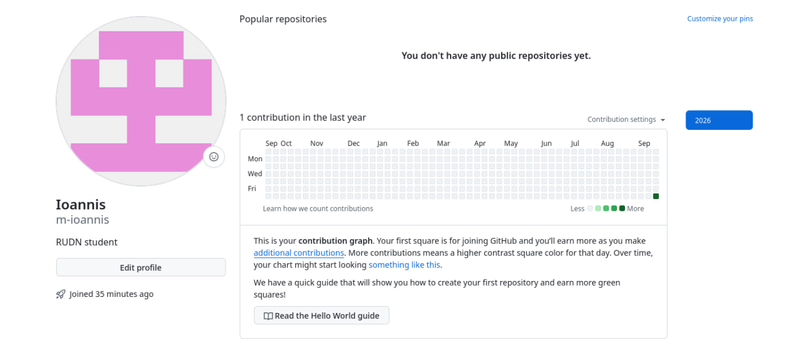
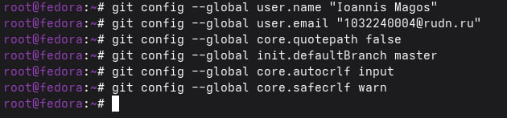
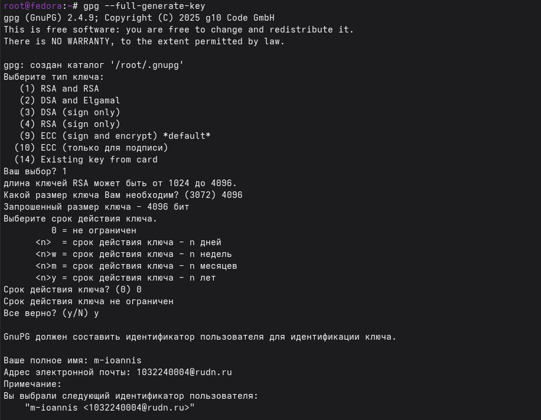
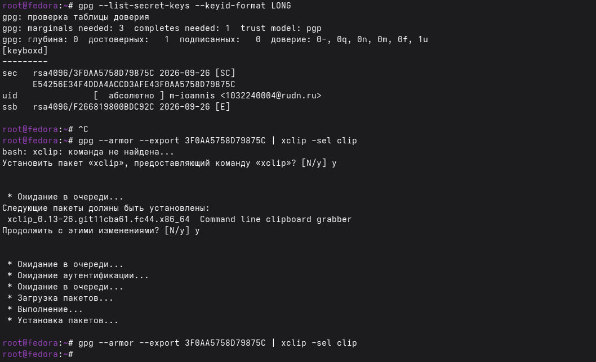
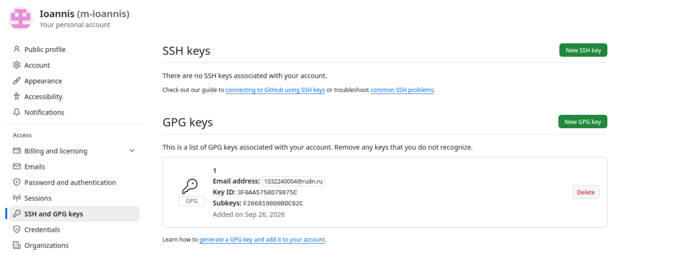
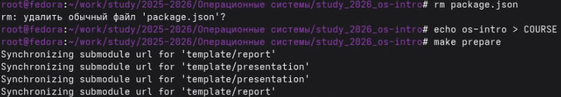
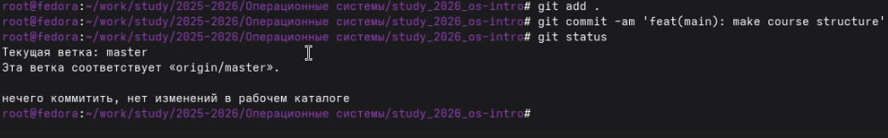

---
## Author
author: 
  name: Магос Иоаннис
  email: 1032240004@rudn.ru
  affiliation:
    - name: Российский университет дружбы народов
      country: Российская Федерация
      postal-code: 117198
      city: Москва
      address: ул. Миклухо-Маклая, д. 6
	  
## Title
title: Операционные системы
subtitle: Система контроля версий git, управление версиями
license: CC BY
date: today
date-format: "YYYY-MM-DD"
---

# Цели и задачи работы

## Цель лабораторной работы

Целью данной работы является изучение идеологии и применения средств контроля версий, освоение умения по работе с git.

# Процесс выполнения лабораторной работы

## 1. Установили git и gh.

{ #fig:001 width=70% }

## 2. Создаём учётную запись Github.

{ #fig:002 width=70% }

## 3. Зададим почту и имя владельца репозитория, кодировку и другие данные.

{ #fig:003 width=70% }

## 4. Создаем SSH ключи

{ #fig:004 width=70% }

{ #fig:005 width=70% }

## 5. Создаем GPG ключ и копируем его в буфер обмена 

{ #fig:006 width=70% }

{ #fig:007 width=70% }

## 6. Добавляем GPG ключ в аккаунт

{ #fig:008 width=70% }

## 7. Настройка автоматических подписей коммитов

{ #fig:009 width=70% }

## 8. Настройка gh

{ #fig:010 width=70% }

## 9. Загрузка шаблона репозитория и синхронизация

{ #fig:011 width=70% }

## 10. Подготовка репозитория и коммит изменений

{ #fig:012 width=70% }

# Вывод

Мы приобрели практические навыки работы с системой контроля версий git и GitHub, изучили идеологию и применение средств контроля версий.
