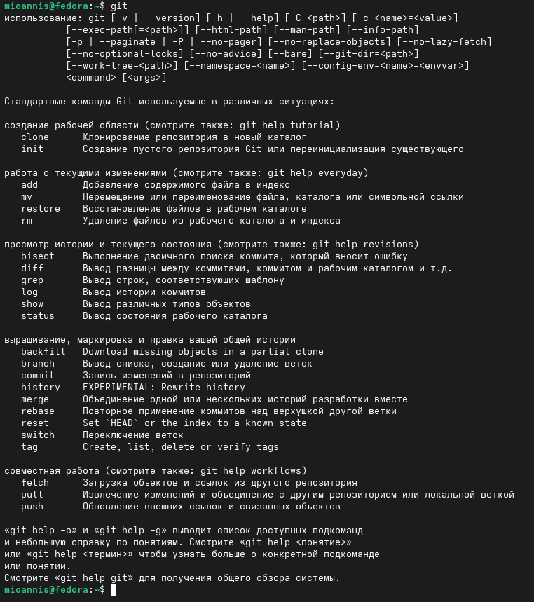
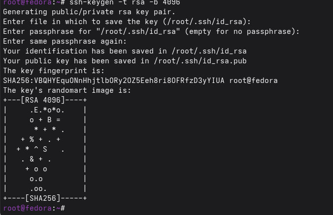
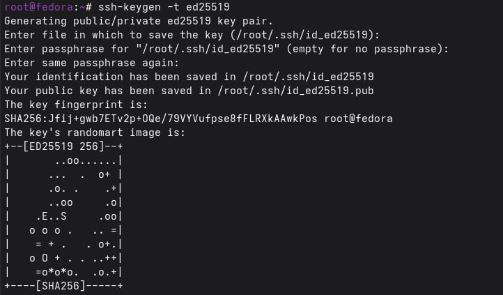
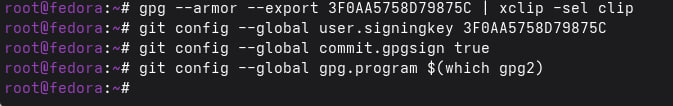
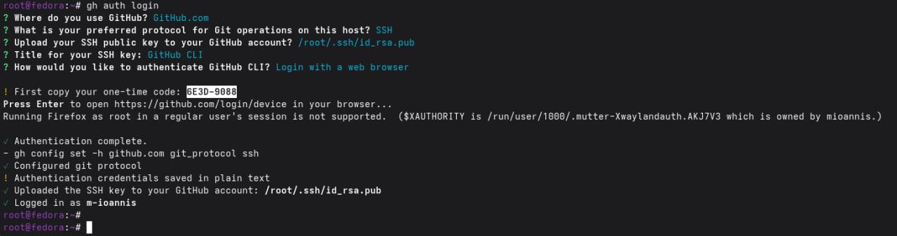

# Цель работы

Целью данной работы является изучение идеологии и применения средств контроля версий, освоение умения по работе с git.

# Выполнение лабораторной работы

1. Установили git и gh.

{ #fig:001 width=70% }

2. Создаём учётную запись Github.

{ #fig:002 width=70% }

3. Зададим почту и имя владельца репозитория, кодировку и другие данные.

{ #fig:003 width=70% }

4. Создаем SSH ключи

{ #fig:004 width=70% }

{ #fig:005 width=70% }

5. Создаем GPG ключ и копируем его в буфер обмена

{ #fig:006 width=70% }

{ #fig:007 width=70% }

6. Добавляем GPG ключ в аккаунт

{ #fig:008 width=70% }

7. Настройка автоматических подписей коммитов

{ #fig:009 width=70% }

8. Настройка gh

{ #fig:010 width=70% }

9. Загрузка шаблона репозитория и синхронизация

{ #fig:011 width=70% }

10. Подготовка репозитория и коммит изменений

{ #fig:012 width=70% }

# Вывод

Мы приобрели практические навыки работы с системой контроля версий git и GitHub, изучили идеологию и применение средств контроля версий.

# Контрольные вопросы

1. Что такое системы контроля версий (VCS) и для решения каких задач они предназначаются?

Системы контроля версий (Version Control System, VCS) используются при совместной работе нескольких человек над одним проектом. Как правило, основная структура проекта хранится в локальном или удалённом репозитории, доступ к которому предоставляется участникам проекта. При внесении изменений в проект система контроля версий позволяет сохранять и отслеживать их, объединять изменения, выполненные разными участниками, а также при необходимости возвращаться к любой предыдущей версии проекта.

2. Объясните следующие понятия VCS и их отношения: хранилище, commit, история, рабочая копия.

* **Хранилище** — пространство на накопителе, в котором находится репозиторий проекта.

* **Commit** — фиксация текущего состояния хранилища в определённый момент времени.

* **История** — последовательность изменений хранилища, представленная в виде списка выполненных коммитов.

* **Рабочая копия** — локальная версия сетевого репозитория, с которой непосредственно работает программист. Она содержит текущее состояние файлов проекта, основанное на версии, загруженной из хранилища (обычно последней).

3. Что представляют собой и чем отличаются централизованные и децентрализованные VCS? Приведите примеры VCS каждого вида.

Централизованные системы контроля версий представляют собой приложения по типу клиент-сервер, в которых репозиторий проекта существует в единственном экземпляре и хранится на сервере. Доступ к нему осуществляется с помощью специального клиентского приложения. Примерами таких систем являются CVS и Subversion.

Распределенные системы контроля версий (Distributed Version Control System, DVCS) позволяют хранить копию репозитория у каждого разработчика, работающего с данной системой. При этом можно условно выделить центральный репозиторий, в который отправляются изменения из локальных репозиториев и с которым они синхронизируются. При работе с такой системой пользователи периодически синхронизируют свои локальные репозитории с центральным и работают непосредственно со своей локальной копией. После внесения достаточного количества изменений они отправляются на сервер. При этом сервер чаще всего является условным понятием, так как в большинстве DVCS отсутствует выделенный сервер с центральным репозиторием.

4. Опишите действия с VCS при единоличной работе с хранилищем.

Один пользователь работает над проектом и по мере необходимости выполняет коммиты, фиксируя отдельные этапы работы.

5. Опишите порядок работы с общим хранилищем VCS.

Несколько пользователей работают каждый над своей частью проекта. При этом каждый разработчик должен работать в отдельной ветке. После завершения работы ветка пользователя объединяется с основной веткой проекта.

6. Каковы основные задачи, решаемые инструментальным средством git?

* Ведение истории версий проекта: журнал (log), метки (tags), ветвления (branches).
* Работа с изменениями: их выявление (diff), слияние (patch, merge).
* Обеспечение совместной работы: получение версии с сервера и загрузка обновлений на сервер.

7. Назовите и дайте краткую характеристику командам git.

* git config - установка параметров
* git status - полный список изменений файлов, ожидающих коммита
* git add . - сделать все измененные файлы готовыми для коммита.
* git commit -m "[descriptive message]" - записать изменения с заданным сообщением.
* git branch - список всех локальных веток в текущей директории.
* git checkout [branch-name] - переключиться на указанную ветку и обновить рабочую директорию.
* git merge [branch] — соединить изменения в текущей ветке с изменениями из заданной.
* git push - запушить текущую ветку в удаленную ветку.
* git pull - загрузить историю и изменения удаленной ветки и произвести слияние с текущей веткой.

8. Приведите примеры использования при работе с локальным и удалённым репозиториями.

* git remote add [имя] [url] — добавляет удалённый репозиторий с заданным именем;
* git remote remove [имя] — удаляет удалённый репозиторий с заданным именем;
* git remote rename [старое имя] [новое имя] — переименовывает удалённый репозиторий;
* git remote set-url [имя] [url] — присваивает репозиторию с именем новый адрес;
* git remote show [имя] — показывает информацию о репозитории.

9. Что такое и зачем могут быть нужны ветви (branches)?

Ветвление — это возможность работать с разными версиями проекта: вместо единой последовательности упорядоченных коммитов история может разделяться в определённых точках. Каждая ветвь содержит лёгковесный указатель HEAD на последний коммит, что позволяет создавать большое количество веток без значительных затрат. Ветка по умолчанию называется master, однако её рекомендуется называть в соответствии с функциональностью, которая в ней разрабатывается.

10. Как и зачем можно игнорировать некоторые файлы при commit?

Некоторые файлы можно исключить из коммитов с помощью файла .gitignore. Это нужно для того, что мы не хотим оставлять в коммите, например временные файлы, логи или настройки среды разработки.
