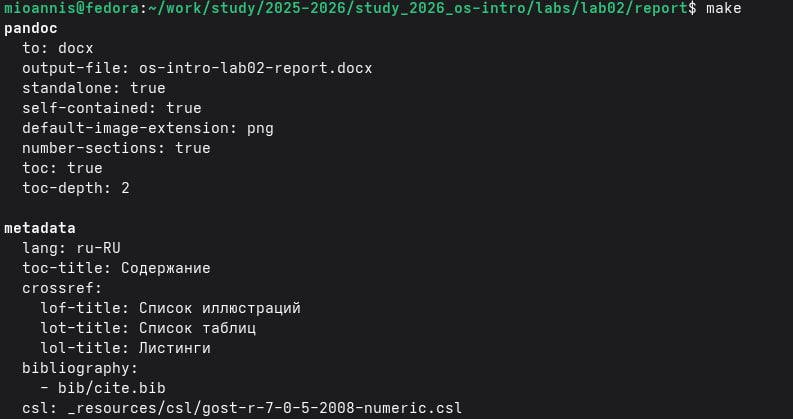
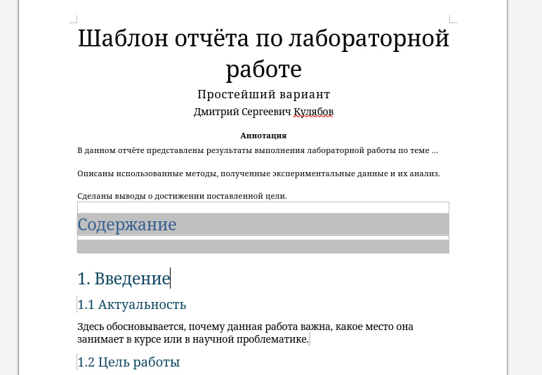
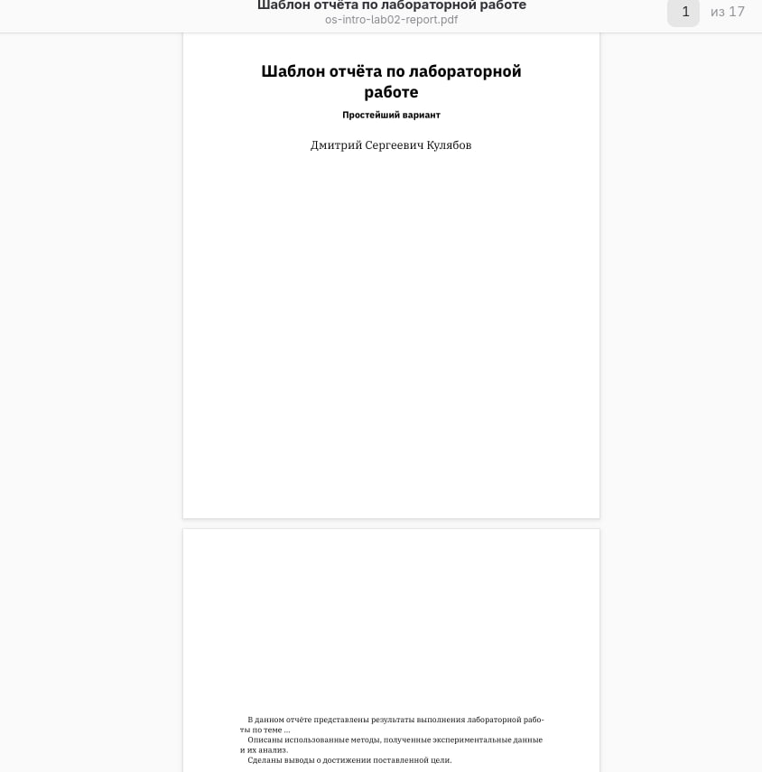
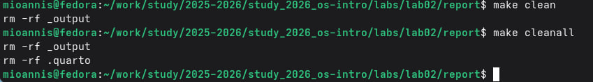
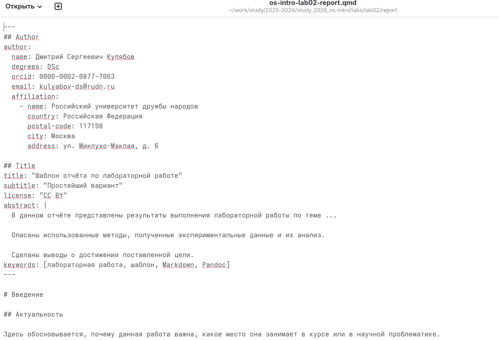
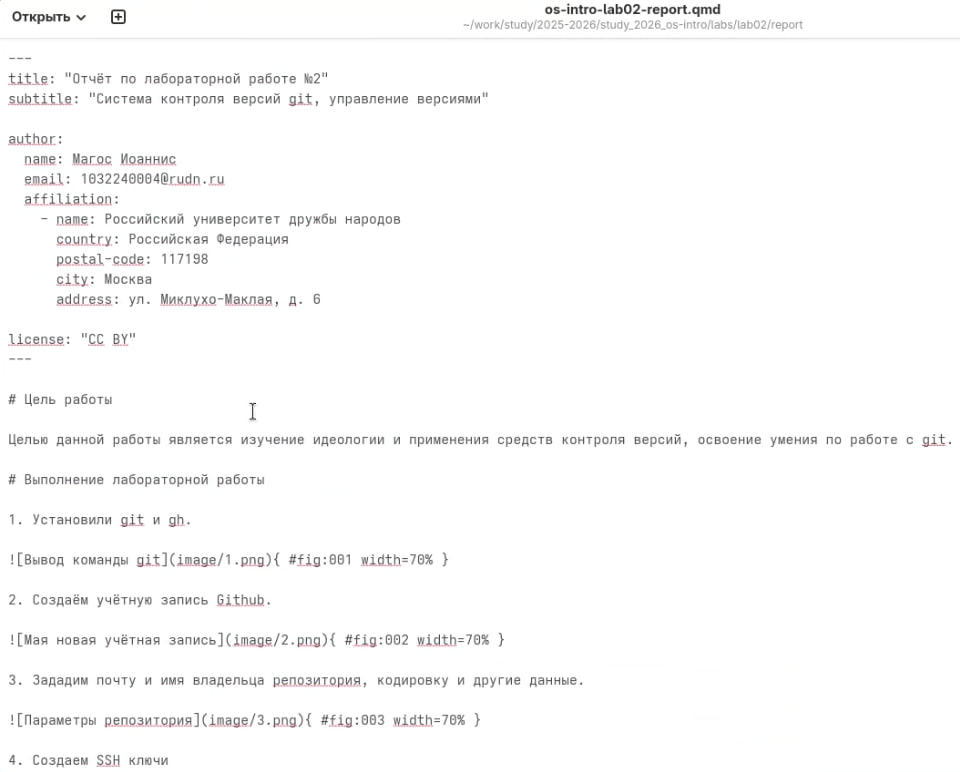
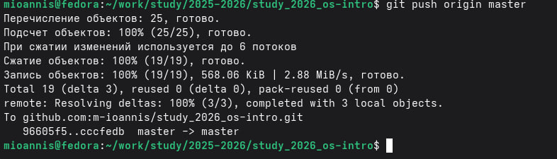

---
## Author
author: 
  name: Магос Иоаннис
  email: 1032240004@rudn.ru
  affiliation:
    - name: Российский университет дружбы народов
      country: Российская Федерация
      postal-code: 117198
      city: Москва
      address: ул. Миклухо-Маклая, д. 6
	  
## Title
title: Отчёт по лабораторной работе №3"
subtitle: Освоение языка разметки Markdown
license: CC BY
date: today
date-format: "YYYY-MM-DD"
---

# Цели и задачи работы

## Цель лабораторной работы

Научиться оформлять отчёты с помощью легковесного языка разметки Markdown

# Выполнение лабораторной работы

## 1. Переходим в католог и конвертируем шаблон отчёта в pdf и docx файлы.

{ #fig:001 width=70% }

## 2. Проверяем корректность конвертации и открываем docx файл.

{ #fig:002 width=70% }

## 3. Проверяем корректность конвертации и открываем pdf файл.

{ #fig:003 width=70% }

## 4. Чистим каталог от лишних файлов шаблона.

{ #fig:004 width=70% }

## 5. Открываем шаблон отчёта.

{ #fig:005 width=70% }

## 6. Меняем шаблон отчёта под себя и сохраняем изменения.

{ #fig:006 width=70% }

## 7. Конвертируем отредактированный шаблон отчёта в pdf и docx файлы.

{ #fig:007 width=70% }

## 8. Отправляем сконвертированные отчёты в свой репозиторий.

{ #fig:008 width=70% }

# Вывод

Мы изучили синтаксис языка разметки Markdown, получили отчеты из шаблона при помощи команды make и Makefile.
