---
## Author
author: 
  name: Магос Иоаннис
  email: 1032240004@rudn.ru
  affiliation:
    - name: Российский университет дружбы народов
      country: Российская Федерация
      postal-code: 117198
      city: Москва
      address: ул. Миклухо-Маклая, д. 6
	  
## Title
title: Отчёт по лабораторной работе №4"
subtitle: Рабочий процесс Gitflow
license: CC BY
date: today
date-format: "YYYY-MM-DD"
---

# Цель работы

Получение навыков правильной работы с репозиториями git.

# Выполнение лабораторной работы

## 1. Установка git-flow

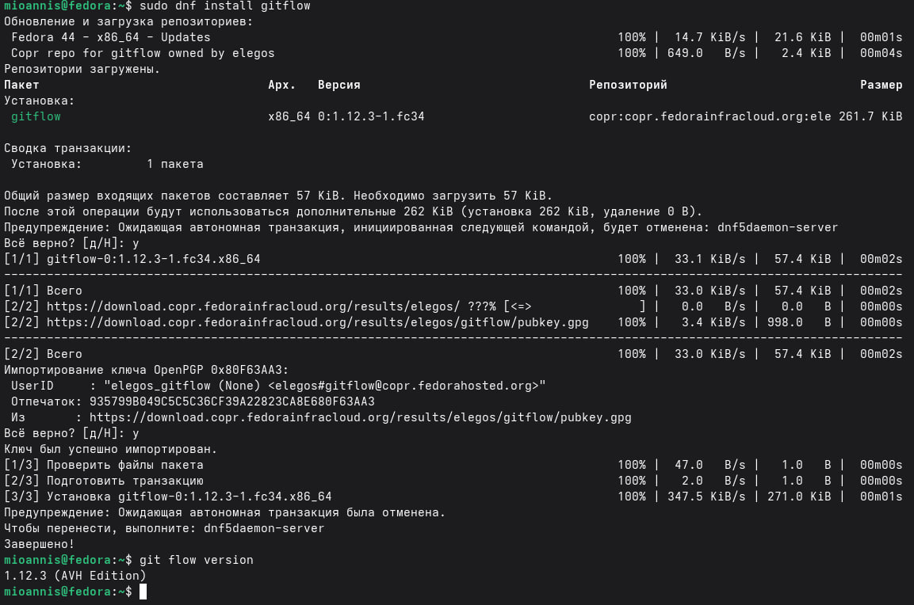{ #fig:001 width=70% }

## 2. Установка Node.js

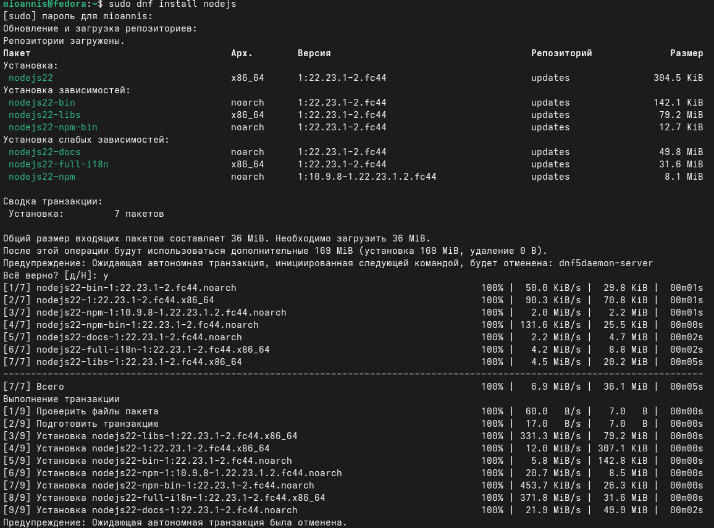{ #fig:002 width=70% }

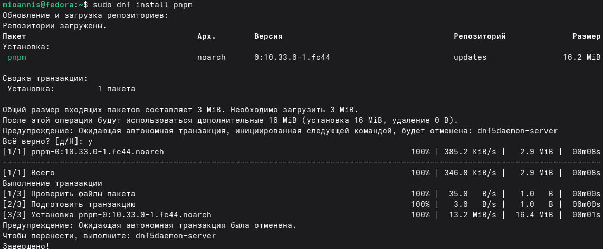{ #fig:003 width=70% }

## 3. Настройка Node.js

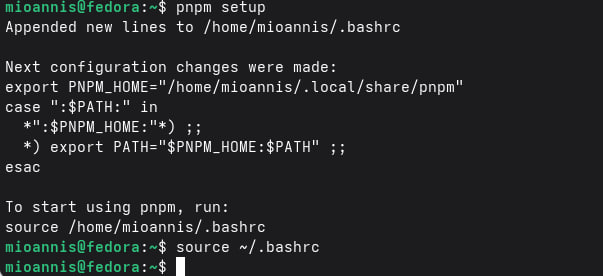{ #fig:004 width=70% }

## 4. Общепринятые коммиты:

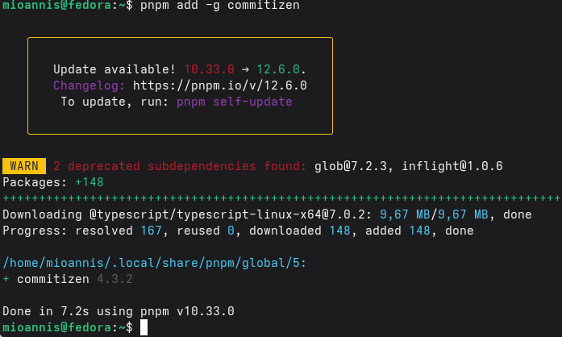{ #fig:005 width=70% }

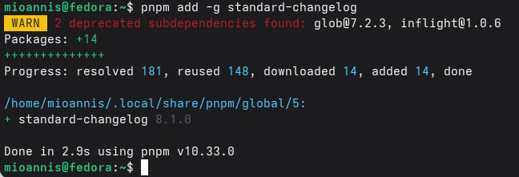{ #fig:006 width=70% }

## 6. Подключение репозитория к github

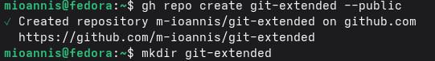{ #fig:007 width=70% }

## 7. Делаем первый коммит и выкладываем на github:

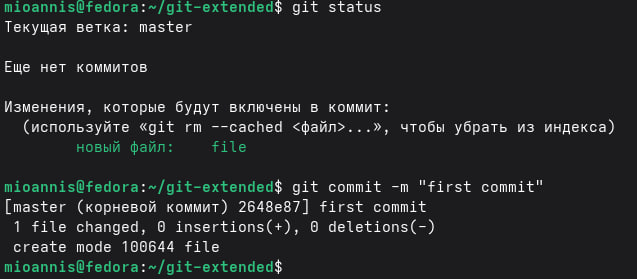{ #fig:008 width=70% }

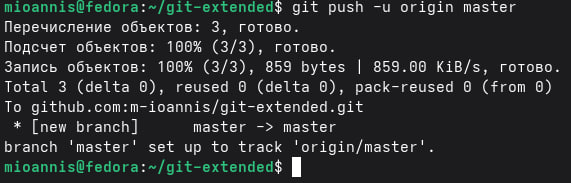{ #fig:009 width=70% }

## 9. Конфигурация общепринятых коммитов

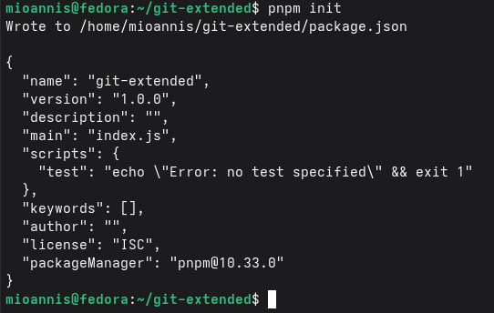{ #fig:010 width=70% }

## 10. Заполняем свои данные в файл

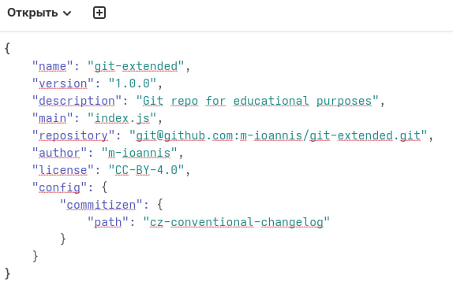{ #fig:011 width=70% }

## 11. Сохраняем и делаем коммит

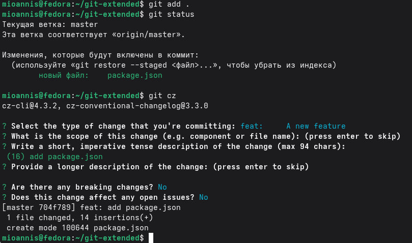{ #fig:012 width=70% }

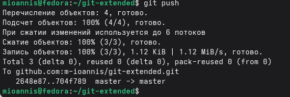{ #fig:013 width=70% }

## 12. Конфигурация git-flow

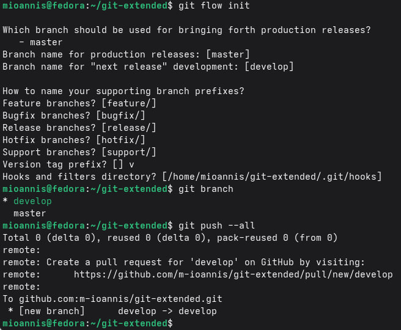{ #fig:014 width=70% }

## 13. Установка внешней ветки как вышестоящей для этой ветки

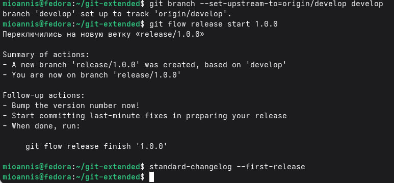{ #fig:015 width=70% }

## 14. Добавим журнал изменений в индекс

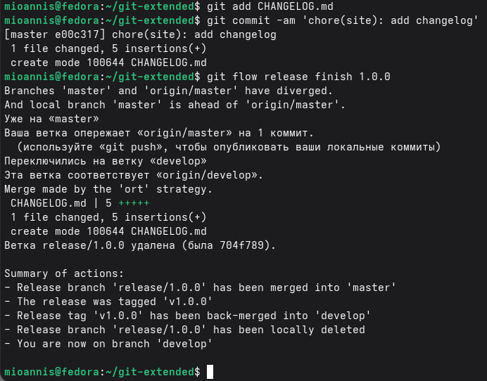{ #fig:016 width=70% }

## 15. Отправим данные на github и создаём релиз

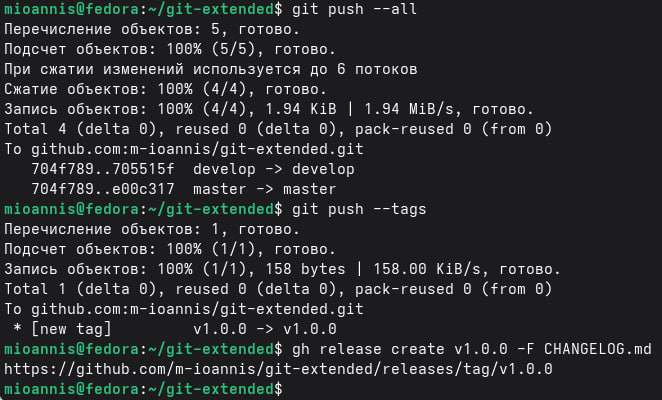{ #fig:017 width=70% }

## 16. Работа с репозиторием git

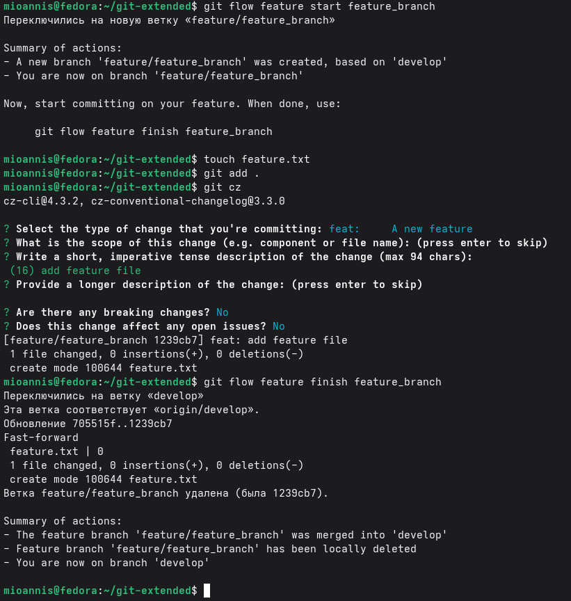{ #fig:018 width=70% }

## 17. Создание релиза git-flow с версией 1.2.3

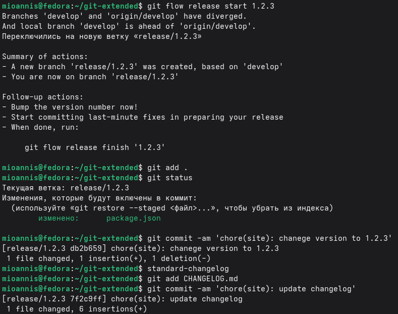{ #fig:019 width=70% }

## 18. Зальём релизную ветку в основную ветку

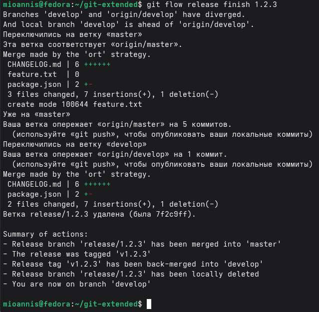{ #fig:020 width=70% }

## 19. Отправим данные на github и Создадим релиз

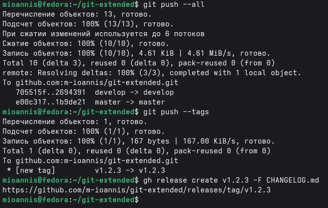{ #fig:021 width=70% }

# Вывод

Мы научились правильно работать с репозиториями git, создавать релизы и вести журнал изменений.