---
## Author
author: 
  name: Магос Иоаннис
  email: 1032240004@rudn.ru
  affiliation:
    - name: Российский университет дружбы народов
      country: Российская Федерация
      postal-code: 117198
      city: Москва
      address: ул. Миклухо-Маклая, д. 6
	  
## Title
title: Отчёт по лабораторной работе №5"
subtitle: Менеджер паролей pass
license: CC BY
date: today
date-format: "YYYY-MM-DD"
---

# Цель работы

Получение навыков правильной работы с менеджером паролей pass.

# Выполнение лабораторной работы

## 1. Установка pass

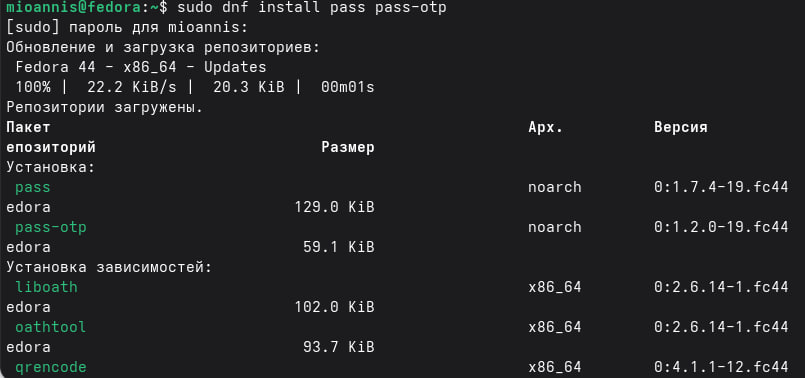{ #fig:001 width=70% }

## 2. Установка gopass

{ #fig:002 width=70% }

## 3. Просмотр списка gpg ключей 

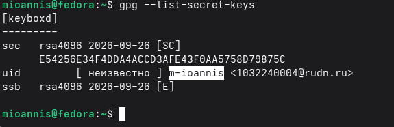{ #fig:003 width=70% }

## 4. Инициализация хранилища

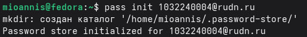{ #fig:004 width=70% }

## 5. Проверяем наличие ~/.password-store/

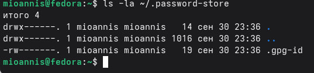{ #fig:005 width=70% }

## 6. Создадим структуру git:

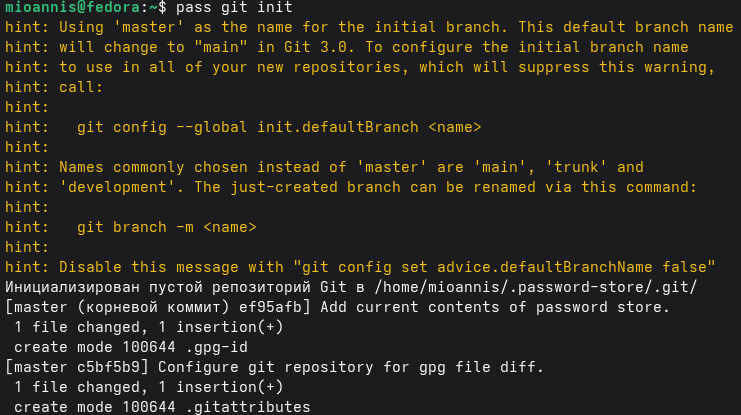{ #fig:006 width=70% }

## 7. Подключение репозитория к github

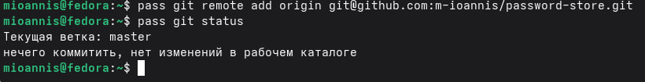{ #fig:007 width=70% }

## 8. Настройка интерфейса с броузером

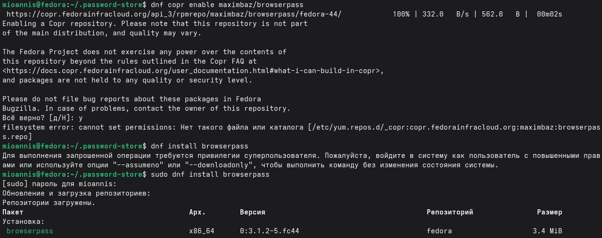{ #fig:008 width=70% }

## 9. Добавляю новый пароль

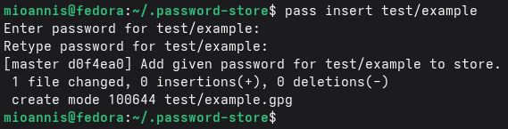{ #fig:009 width=70% }

## 10. Заменяю существующий пароль

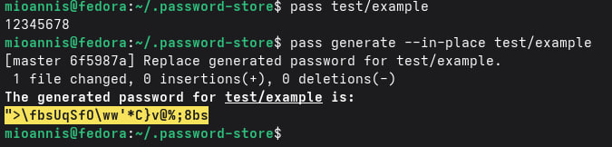{ #fig:010 width=70% }

## 11. Дополнительное программное обеспечение

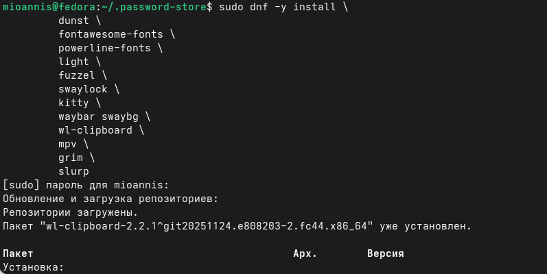{ #fig:011 width=70% }

## 12. Установка дополнительных шрифтов

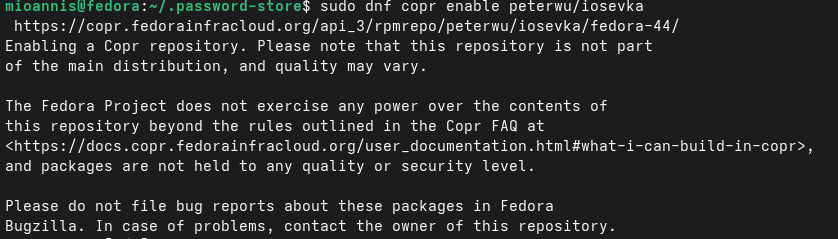{ #fig:012 width=70% }

## 13. Установка chezmoi через скрипт исползуя wget

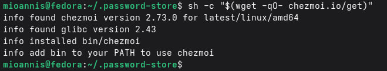{ #fig:013 width=70% }

## 14. Создание собственного репозитория и его инициализация через chezmoi

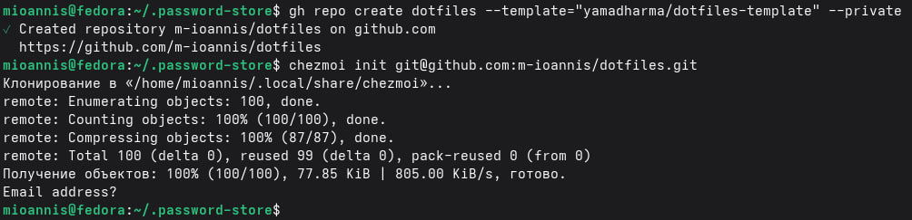{ #fig:014 width=70% }

## 15. Подключение репозитория к своей системе

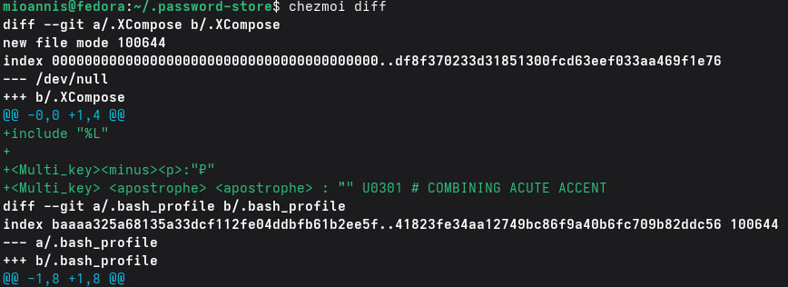{ #fig:015 width=70% }

# Вывод

Мы научились правильно работать с менеджером паролей pass и другим программным обеспечением, а также настоили его.