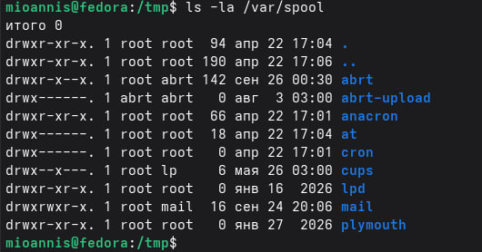
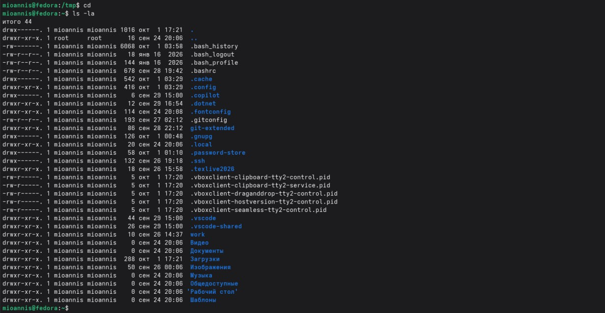
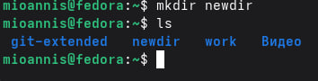
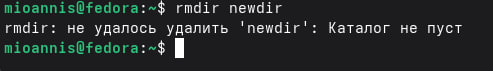
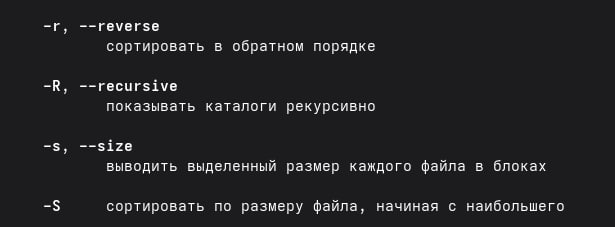
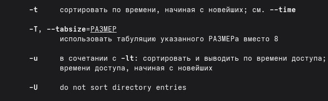
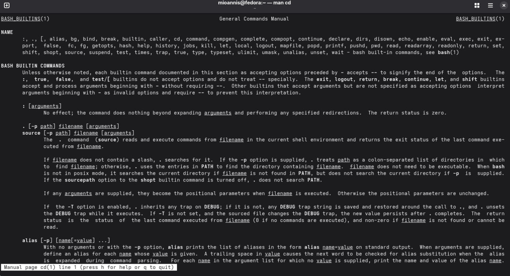
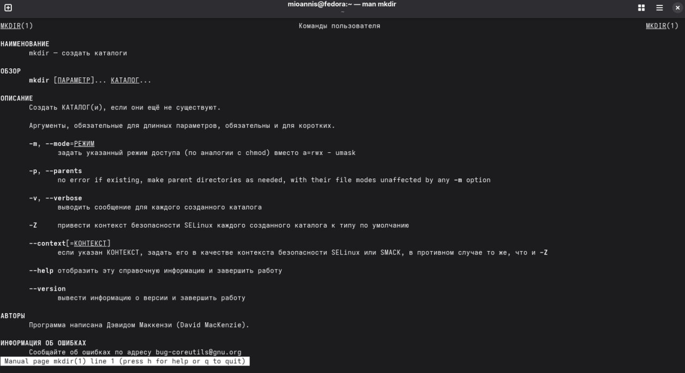
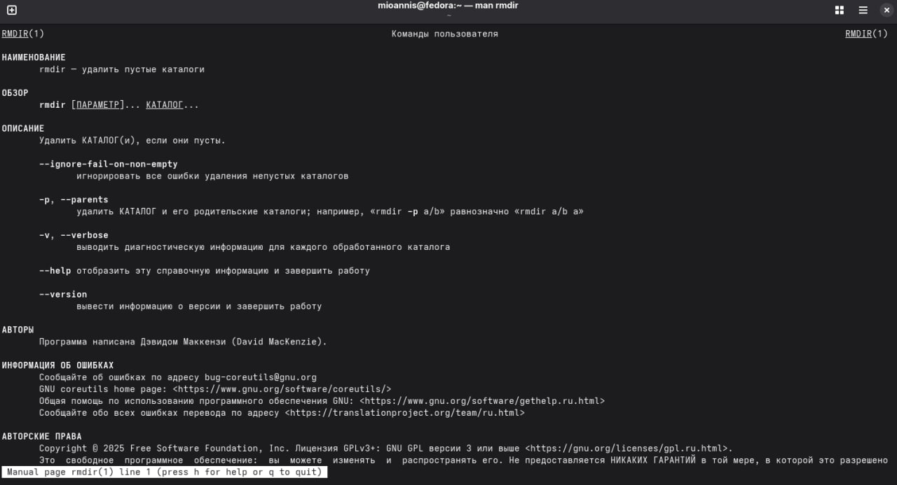
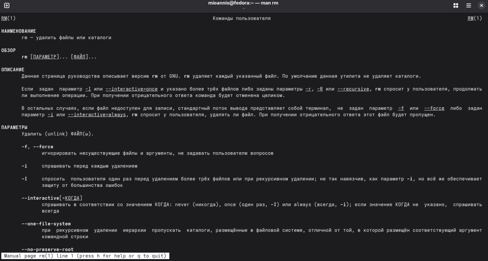

---
## Author
author: 
  name: Магос Иоаннис
  email: 1032240004@rudn.ru
  affiliation:
    - name: Российский университет дружбы народов
      country: Российская Федерация
      postal-code: 117198
      city: Москва
      address: ул. Миклухо-Маклая, д. 6
	  
## Title
title: Отчёт по лабораторной работе №6"
subtitle: Основы интерфейса взаимодействия пользователя с системой Unix на уровне командной строки
license: CC BY
date: today
date-format: "YYYY-MM-DD"
---

# Цель работы

Приобретение практических навыков взаимодействия пользователя с системой по-
средством командной строки.

# Выполнение лабораторной работы

## 1. Определяем полное имя вашего домашнего каталога.

{ #fig:001 width=70% }

## 2. Переходим в каталог /tmp

{ #fig:002 width=70% }

## 3. Выводим содержимое каталога с разными опциями команды ls

{ #fig:003 width=70% }

## 4. Определяем, есть ли в каталоге /var/spool подкаталог с именем cron

{ #fig:004 width=70% }

## 5. Просмотр домашнего каталога и определение владельца

{ #fig:005 width=70% }

## 6. Создание каталогов newdir и morefun

{ #fig:006 width=70% }

## 7. Проверяем содержимое каталога newdir

{ #fig:007 width=70% }

## 8. Создание и удаление каталогов letters, memos, misk

{ #fig:008 width=70% }

## 9. Попытка удаления каталога командой rm без опций

{ #fig:009 width=70% }

{ #fig:010 width=70% }

## 10. Определение опции для рекурсивного просмотра

{ #fig:011 width=70% }

## 11. Определяю опцию для сортировки по времени

{ #fig:012 width=70% }

## 12. Просмотр описания команды cd

{ #fig:013 width=70% }

## 13. Просмотр описания команды pwd

{ #fig:014 width=70% }

## 14. Просмотр описания команды mkdir

{ #fig:015 width=70% }

## 15. Просмотр описания команды rmdir

{ #fig:016 width=70% }

## 16. Просмотр описания команды rm

{ #fig:017 width=70% }

## 17. Использование history

{ #fig:018 width=70% }

## 18. Выполняю модификацию команды из истории

{ #fig:019 width=70% }

# Вывод

В ходе выполнения лабораторной работы приобрёл практические навыки взаимодействия с
системой посредством командной строки. Освоил команды навигации по файловой системе
(cd, pwd), просмотра содержимого каталогов (ls с различными опциями), создания и удаления
каталогов (mkdir, rmdir, rm), получения справки (man) и работы с историей команд (history).
