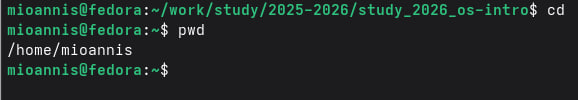
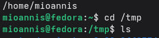
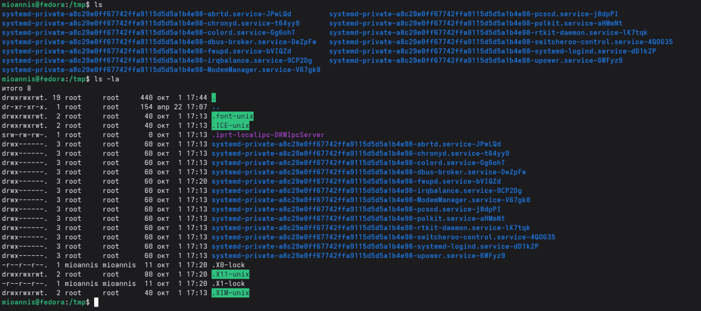
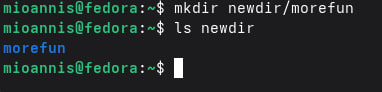
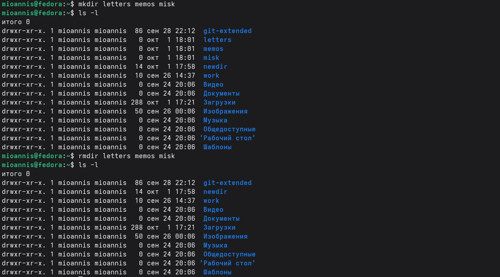
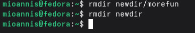
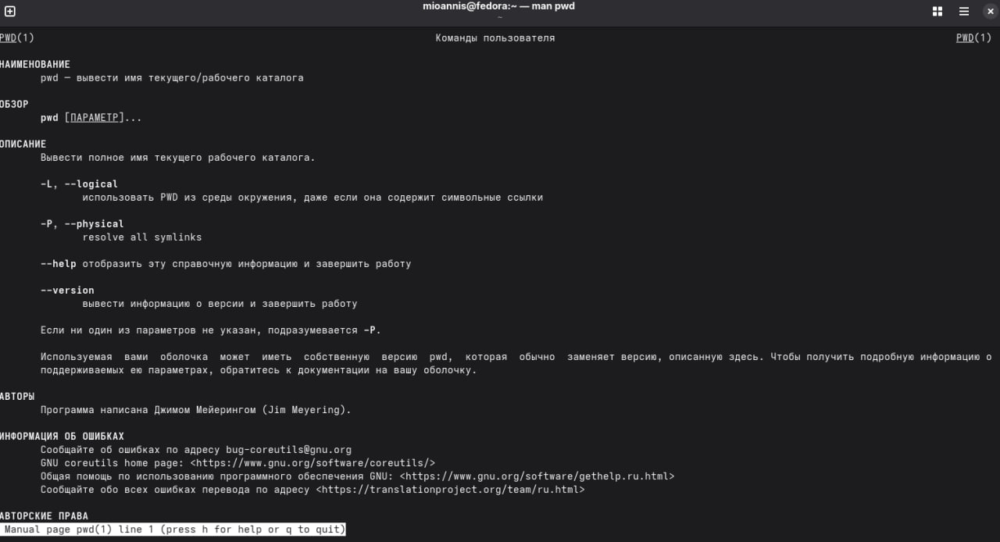
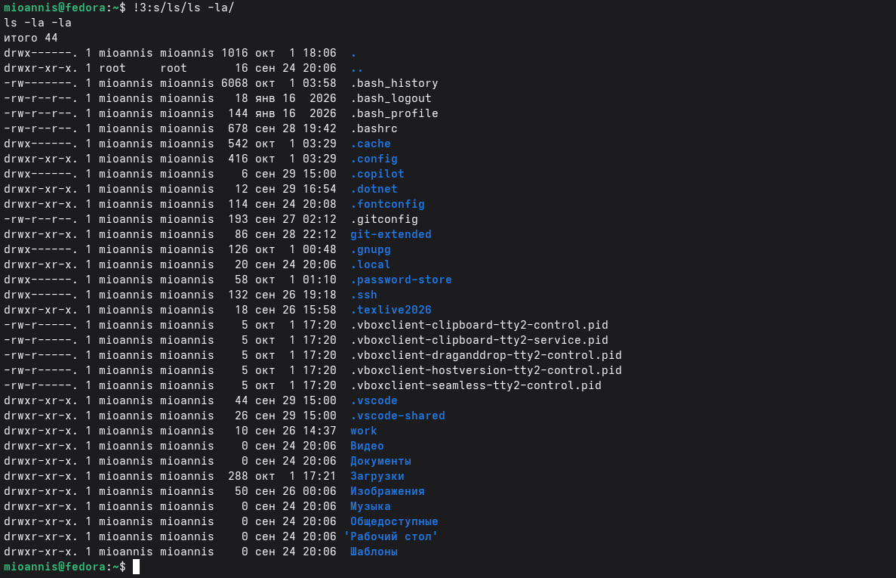
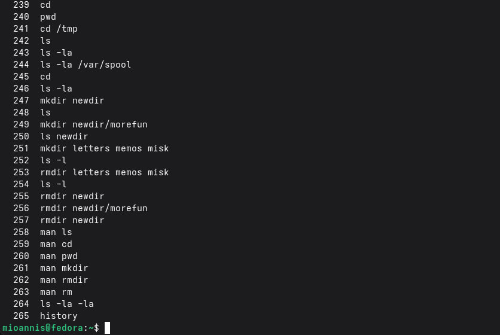

# Цель работы

Приобретение практических навыков взаимодействия пользователя с системой по-
средством командной строки.

# Выполнение лабораторной работы

1. Определяем полное имя вашего домашнего каталога.

{ #fig:001 width=70% }

2. Переходим в каталог /tmp

{ #fig:002 width=70% }

3. Выводим содержимое каталога с разными опциями команды ls

{ #fig:003 width=70% }

4. Определяем, есть ли в каталоге /var/spool подкаталог с именем cron

{ #fig:004 width=70% }

5. Просмотр домашнего каталога и определение владельца

{ #fig:005 width=70% }

6. Создание каталогов newdir и morefun

{ #fig:006 width=70% }

7. Проверяем содержимое каталога newdir

{ #fig:007 width=70% }

8. Создание и удаление каталогов letters, memos, misk

{ #fig:008 width=70% }

9. Попытка удаления каталога командой rm без опций

{ #fig:009 width=70% }

{ #fig:010 width=70% }

10. Определение опции для рекурсивного просмотра

{ #fig:011 width=70% }

11. Определяю опцию для сортировки по времени

{ #fig:012 width=70% }

12. Просмотр описания команды cd

{ #fig:013 width=70% }

13. Просмотр описания команды pwd

{ #fig:014 width=70% }

14. Просмотр описания команды mkdir

{ #fig:015 width=70% }

15. Просмотр описания команды rmdir

{ #fig:016 width=70% }

16. Просмотр описания команды rm

{ #fig:017 width=70% }

17. Использование history

{ #fig:018 width=70% }

18. Выполняю модификацию команды из истории

{ #fig:019 width=70% }

# Вывод

В ходе выполнения лабораторной работы приобрёл практические навыки взаимодействия с
системой посредством командной строки. Освоил команды навигации по файловой системе
(cd, pwd), просмотра содержимого каталогов (ls с различными опциями), создания и удаления
каталогов (mkdir, rmdir, rm), получения справки (man) и работы с историей команд (history).

# Контрольные вопросы

1. Что такое командная строка?
Командная строка — это текстовый интерфейс взаимодействия пользователя с
операционной системой, в котором команды вводятся в виде текста и выполняются
интерпретатором (shell).

2. При помощи какой команды можно определить абсолютный путь текущего каталога?
Команда pwd (print working directory) выводит абсолютный путь текущего каталога:
pwd
Результат: /home/avramenkodavid

3. При помощи какой команды и каких опций можно определить только типфайлов и их
имена?
Команда ls -F добавляет к именам файлов символы, обозначающие их тип: - /
— каталог - * — исполняемый файл - @ — символическая ссылка ls -F

4. Каким образом отобразить информацию о скрытых файлах?
Для отображения скрытых файлов(начинающихсясточки)используетсяопция
-a:
ls -a

5. При помощи каких команд можно удалить файл и каталог?
* rm файл — удаление файла
* rmdir каталог — удаление пустого каталога
* rm -r каталог — рекурсивное удаление каталога с содержимым
* Одной командой rm -r можно удалить и файлы, и каталоги.

6. Каким образом можно вывести информацию о последних выполненныхкомандах?
Команда history выводит список последних выполненных команд с их номерами:
history
7. Как воспользоваться историей команд для их модифицированного выполнения?
Синтаксис: !номер:s/что_заменить/на_что_заменить
!1005:s/a/F # Заменить 'a' на 'F' в команде №1005
8. Приведите примеры запуска нескольких команд в одной строке.
Команды разделяются точкой с запятой: cd /tmp;
ls; pwd
Или с логической связью:
mkdir test && cd test # Вторая выполнится только при успехе первой

9. Дайте определение и приведите примеры символов экранирования.
Символ экранирования \ отменяет специальное значение следующего за ним символа:
echo \* # Выведет символ *
echo "Hello\ World" # Пробел как часть строки ls my\ file.txt
Файл с пробелом в имени

10. Охарактеризуйте вывод информации на экран после выполнения команды ls -l.
Команда ls -l выводит: - Тип файла и права доступа (drwxr-xr-x) - Число жёстких ссылок - Имя
владельца - Имя группы - Размер в байтах - Дата и время последнего изменения - Имя файла
или каталога

11. Что такое относительный путь к файлу?
Относительный путь — путь от текущего каталога, не начинающийся с /.
Абсолютный путь: /home/avramenkodavid/work/file.txt
Относительныйпуть(издомашнегокаталога):work/file.txt или./work/file.txt Относительный путь с
переходом вверх: ../другой_каталог/file.txt

12. Как получить информацию об интересующей вас команде?
Команда man выводит руководство по указанной команде:
man ls man
cd
Также можно использовать --help:
ls --help

13. Какая клавиша служит для автоматического дополнения вводимыхкоманд?
Клавиша Tab автоматически дополняет имена команд, файлов и каталогов.
Двойное нажатие Tab показывает все возможные варианты дополнения.