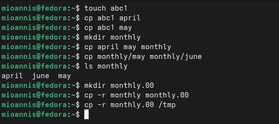
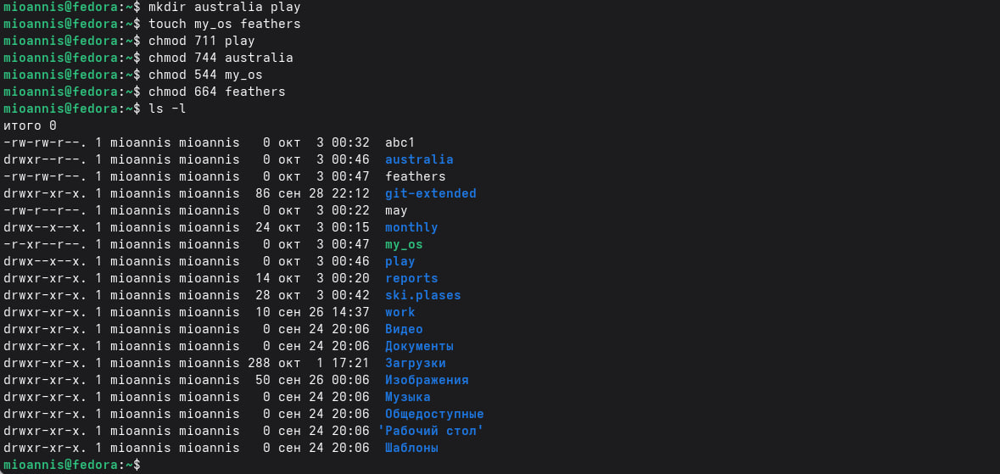
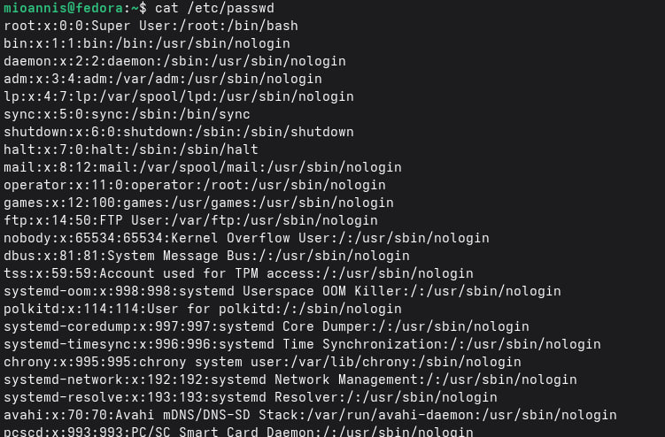
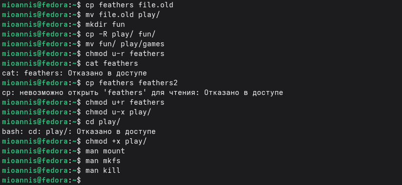
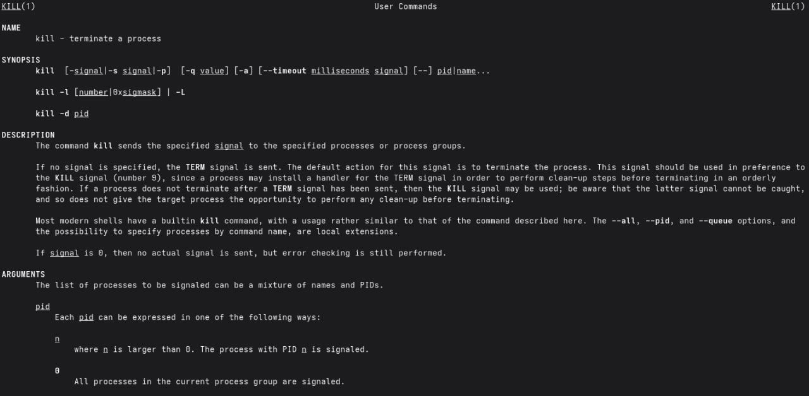
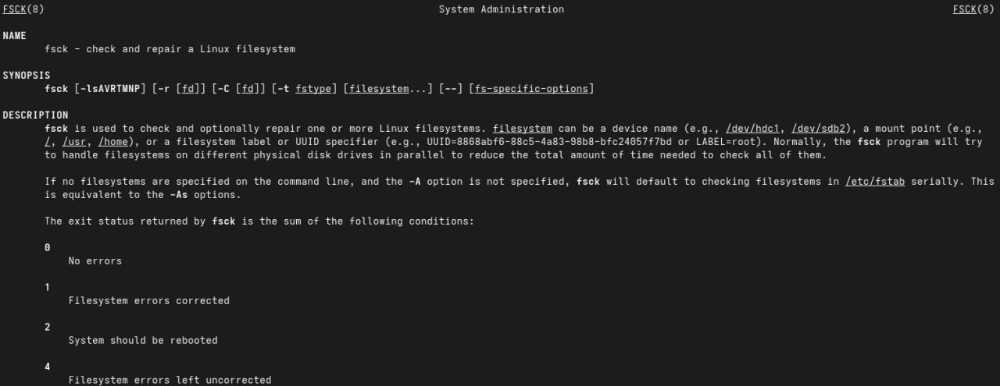

---
## Author
author: 
  name: Магос Иоаннис
  email: 1032240004@rudn.ru
  affiliation:
    - name: Российский университет дружбы народов
      country: Российская Федерация
      postal-code: 117198
      city: Москва
      address: ул. Миклухо-Маклая, д. 6
	  
## Title
title: Презентация по лабораторной работе №7"
subtitle: Анализ файловой системы Linux. Команды для работы с файлами и каталогами
license: CC BY
date: today
date-format: "YYYY-MM-DD"
---

# Цель работы

Ознакомление с файловой системой Linux, её структурой, именами и содержанием каталогов.

Приобретение практических навыков по применению команд для работы с файлами и каталогами, по управлению процессами и работами, по проверке использования диска и обслуживанию файловой системы.

# Выполнение лабораторной работы

## 1. Выполнение примеров из первой части

{#fig:001 width=75%}

---

{#fig:002 width=75%}

---

{#fig:003 width=75%}

## 2. Работа с каталогами

{#fig:004 width=75%}

## 3. Права доступа

Определим опции команды `chmod`, необходимые для присвоения файлам нужных прав доступа:

- `Australia` — `drwxr--r--`
- `play` — `drwx--x--x`
- `My_oc` — `-r-xr--r--`
- `feathers` — `-rw-rw-r--`

---

{#fig:005 width=75%}

## 4. Упражнения четвёртой части

{#fig:006 width=75%}

---

{#fig:007 width=75%}

## 5. Инструкции к команде mount

{#fig:008 width=75%}

## 6. Инструкции к команде mkfs

{#fig:009 width=75%}

## 7. Инструкции к команде kill

{#fig:010 width=75%}

## 8. Инструкции к команде fsck

{#fig:011 width=75%}

# Вывод

В ходе данной работы мы ознакомились с файловой системой Linux, её структурой, именами и содержанием каталогов. Научились совершать базовые операции с файлами, управлять правами их доступа для пользователя и групп. Ознакомились с Анализом файловой системы. А также получили базовые навыки по проверке использования диска и обслуживанию файловой системы.