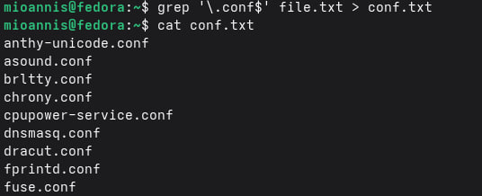
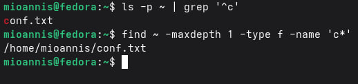
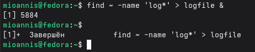
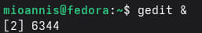
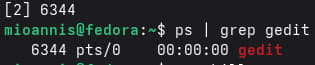
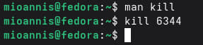
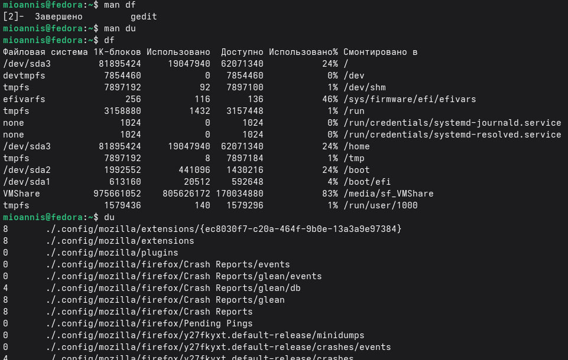

---
## Author
author: 
  name: Магос Иоаннис
  email: 1032240004@rudn.ru
  affiliation:
    - name: Российский университет дружбы народов
      country: Российская Федерация
      postal-code: 117198
      city: Москва
      address: ул. Миклухо-Маклая, д. 6
	  
## Title
title: Презентация по лабораторной работе №8"
subtitle: Поиск файлов. Перенаправление ввода-вывода. Просмотр запущенных процессов
license: CC BY
date: today
date-format: "YYYY-MM-DD"
---

# Цель работы

Ознакомление с инструментами поиска файлов и фильтрации текстовых данных. Приобретение практических навыков: по управлению процессами (и заданиями), по проверке использования диска и обслуживанию файловых систем.

# Выполнение лабораторной работы

## 1. Проверяем, под каким пользователем мы зашли в систему.

{ #fig:001 width=70% }

## 2. Записываем в файл file.txt названия файлов, из /etc и файлов из домашнего каталога.

{ #fig:002 width=70% }

## 3. Записываем в файл conf.txt названия файлов из file.txt, которые содержат расширение .conf.

{ #fig:003 width=70% }

## 4. Два способа показать, какие файлы домашнего каталога начинаются с символа "c"

{ #fig:004 width=70% }

## 5. Имена файлов из каталога /etc, начинающиеся с символа "h"

{ #fig:005 width=70% }

## 6. Запуск фонового процесса, который будет записывать в файл ~/logfile файлы, имена которых начинаются с log.

{ #fig:006 width=70% }

## 7. Удаляем файл logfile.

{ #fig:007 width=70% }

## 8. Запускаем из консоли в фоновом режиме редактор gedit.

{ #fig:008 width=70% }

## 9. Определяем идентификатор процесса gedit.

{ #fig:009 width=70% }

## 10. Смотрим инструкцию к команде kill и завершаем процесс gedit.

{ #fig:010 width=70% }

## 11. Изучаем и применяем новые команды df и du.

{ #fig:011 width=70% }

## 12. Воспользовавшись справкой команды find, выводим имена всех директорий, имеющихся в нашем домашнем каталоге.

{ #fig:012 width=70% }

# Вывод

В данной работе мы ознакомились с инструментами поиска файлов и фильтрации текстовых данных. А также приобрели практические навыки по управлению процессами. 
