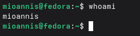
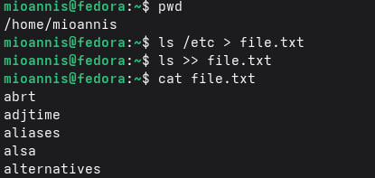
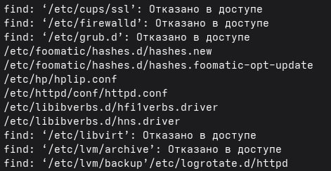
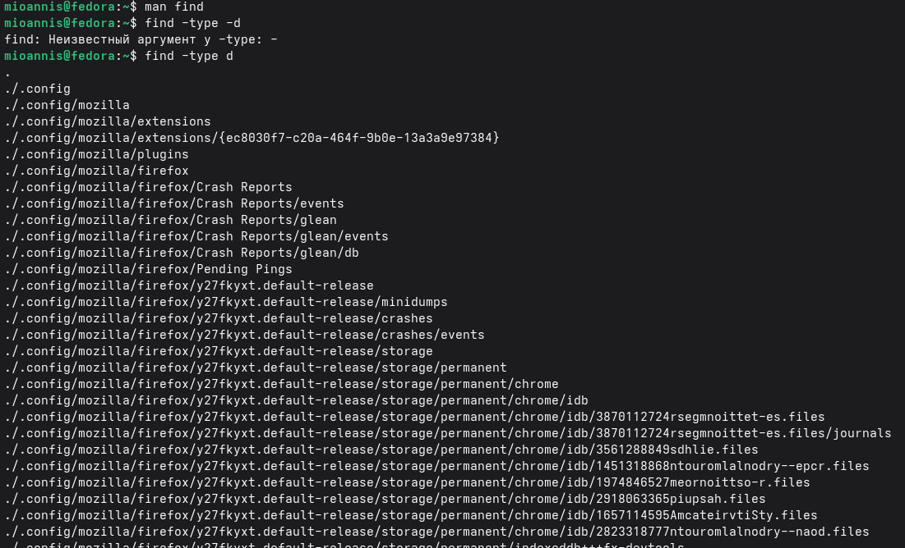

## Цель работы

Ознакомление с инструментами поиска файлов и фильтрации текстовых данных.
Приобретение практических навыков: по управлению процессами (и заданиями), по
проверке использования диска и обслуживанию файловых систем.

# Выполнение лабораторной работы

1. Проверяем, под каким пользователем мы зашли в систему.

{ #fig:001 width=70% }

2. Записываем в файл file.txt названия файлов, из /etc и файлов из домашнего каталога.

{ #fig:002 width=70% }

3. Записываем в файл conf.txt названия файлов из file.txt, которые содержат расширение .conf.

{ #fig:003 width=70% }

4. Два способа показать, какие файлы домашнего каталога начинаются с символа "c"

{ #fig:004 width=70% }

5. Имена файлов из каталога /etc, начинающиеся с символа "h"

{ #fig:005 width=70% }

6. Запуск фонового процесса, который будет записывать в файл ~/logfile файлы, имена которых начинаются с log.

{ #fig:006 width=70% }

7. Удаляем файл logfile.

{ #fig:007 width=70% }

8. Запускаем из консоли в фоновом режиме редактор gedit.

{ #fig:008 width=70% }

9. Определяем идентификатор процесса gedit.

{ #fig:009 width=70% }

10. Смотрим инструкцию к команде kill и завершаем процесс gedit.

{ #fig:011 width=70% }

11. Изучаем и применяем новые команды df и du.

{ #fig:011 width=70% }

12. Воспользовавшись справкой команды find, выводим имена всех директорий, имеющихся в нашем домашнем каталоге.

{ #fig:012 width=70% }

# Вывод

В данной работе мы ознакомились с инструментами поиска файлов и фильтрации текстовых данных. А также приобрели практические навыки по управлению процессами. 

# Контрольные вопросы

1. Какие потоки ввода вывода вы знаете?
Ответ: 
* stdin — стандартный поток ввода (клавиатура),

* stdout — стандартный поток вывода (консоль),

* stderr — стандартный поток вывод сообщений об ошибках на экран

2. Объясните разницу между операцией > и >>
Ответ: 
Разница заключается в том, что Символ > используется для переназначения стандартного ввода команды, а символ >> используется для присоединения данных в конец файла стандартного вывода команды.

3. Что такое конвейер?
Ответ: Конвейер – это способ связи между двумя программами. 
Например: конвейер pipe служит для объединения простых команд или утилит в цепочки, в которых результат работы предыдущей команды передается последующей. 
Синтаксис у конвейера  следующий: команда1 | команда 2

4. Что такое процесс? Чем это понятие отличается от программы?
Ответ: Процесс - это программа, которая выполняется в отдельном виртуальном адресном пространстве независимо от других программ или их пользованию по необходимости. \

5. Что такое PID и GID?
Ответ: Во первых id — UNIX-утилита, выводящая информацию об указанном пользователе USERNAME или текущем пользователе, который запустил данную команду и не указал явно имя пользователя.
*	GID – (Group ID) - идентификатор группы 
*	UID – (User ID) - идентификатор пользователя
Обычно UID  является — положительным целым число м в диапазоне от 0 до 65535, по которому в системе однозначно отслеживаются действия пользователя

6. Что такое задачи и какая команда позволяет ими управлять?
Ответ: Запущенные фоном программы называются задачами(процессами) (jobs). Ими можно управлять с помощью команды jobs, которая выводит список запущенных в данный момент процессов. Для завершения процесса необходимо выполнить команду :
kill % номер задачи

7. Найдите информацию об утилитах top и htop. Каковы их функции?
Ответ: 
Top это консольная команда, которая выводит список работающих в системе процессов и информации о них. По умолчанию она в реальном времени сортирует их по нагрузке на процессор.Htop же является альтернативой программы top она предназначенная для вывода на терминал списка запущенных процессов и информации о них.

8. Назовите и дайте характеристику команде поиска файлов. Приведите примеры использования этой команды.
Ответ: Команда find используется для поиска и отображения имен файлов, соответствующих заданной строке символов.
Синтаксис: find trek [-options]
Пример:
Задача - Вывести на экран имена файлов из каталога /etc и его подкаталогов, Заканчивающихся на k:
find ~ -name "*k" -print

9. Можно ли по контексту (содержанию) найти файл? Если да, то как?
Ответ: Можно, команда grep способна обрабатывать вывод других файлов. Для этого надо использовать конвейер, связав вывод команды с вводом grep.
Пример:
Задача - показать строки в каталоге /dreams с именами начинающимися на t, в которых есть фраза:  I like of Operating systems
grep I like of Operating systems t*

10. Как определить объем свободной памяти на жёстком диске?
Ответ:
Команда df показывает размер каждого смонтированного раздела диска.
Например команда: df -h

11. Как определить объем вашего домашнего каталога?
Ответ: Команда du показывает число килобайт, используемое каждым файлом или каталогом.
Например команда: du -sh

12. Как удалить зависший процесс?
Ответ: Перед тем, как выполнить остановку процесса, нужно определить его PID. Когда известен PID , мы можем убить его командой kill. Команда kill принимает в качестве параметра PID процесса. 
PID можно узнать с помощью команд ps, grep, top или htop.