---
## Author
author: 
  name: Магос Иоаннис
  email: 1032240004@rudn.ru
  affiliation:
    - name: Российский университет дружбы народов
      country: Российская Федерация
      postal-code: 117198
      city: Москва
      address: ул. Миклухо-Маклая, д. 6
	  
## Title
title: Презентация по лабораторной работе №9"
subtitle: Командная оболочка Midnight Commander
license: CC BY
date: today
date-format: "YYYY-MM-DD"
---

# Цель работы

Освоение основных возможностей командной оболочки Midnight Commander. Приоб-
ретение навыков практической работы по просмотру каталогов и файлов; манипуляций
с ними.

# Выполнение лабораторной работы

## 1. Изучим информацию о mc, вызвав в командной строке man mc.

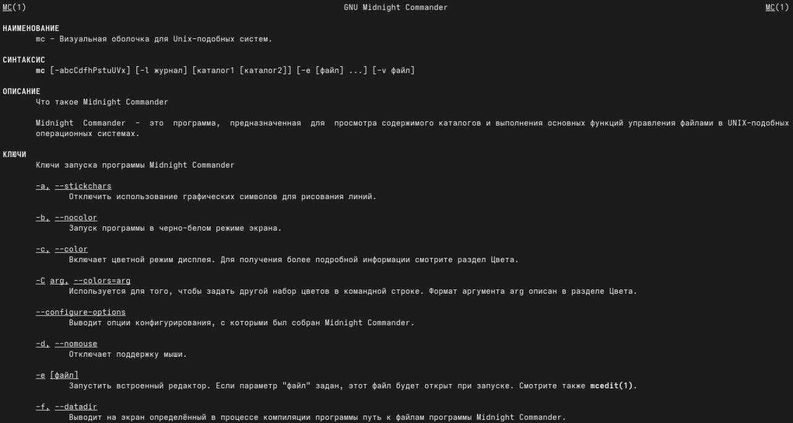{ #fig:001 width=70% }

## 2. Запустим из командной строки mc, изучим его структуру и меню.

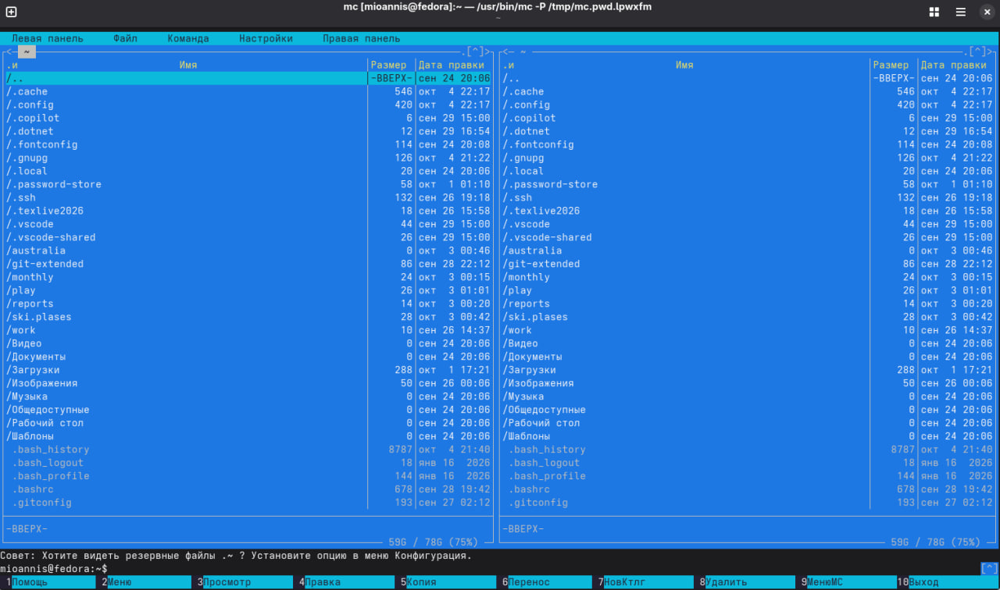{ #fig:002 width=70% }

## 3. Выполним несколько операций в mc, выделяем и копируем файл conf.txt

{ #fig:003 width=70% }

## 4. Получаем информацию о размере и правах доступа на файл, оценим степень подробности вывода информации о файлах.

{ #fig:004 width=70% }

## 5. Используя возможности подменю "Файл" просмотрим и изменим содержимое conf.txt, без сохранения

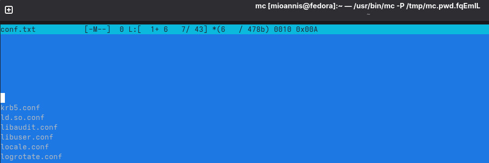{ #fig:005 width=70% }

## 6. Создание каталога test dir

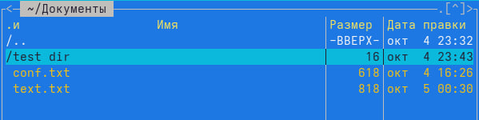{ #fig:006 width=70% }

## 7. Копируем в него файл feathers

{ #fig:007 width=70% }

## 8. С помощью средств подменю "Команда" ищем файлы .cpp которые содержат строку "main"

{ #fig:008 width=70% }

## 9. Выбираем из истории команду cd и возвращаемся в домашний каталог.

{ #fig:009 width=70% }

## 10. Анализируем файл меню.

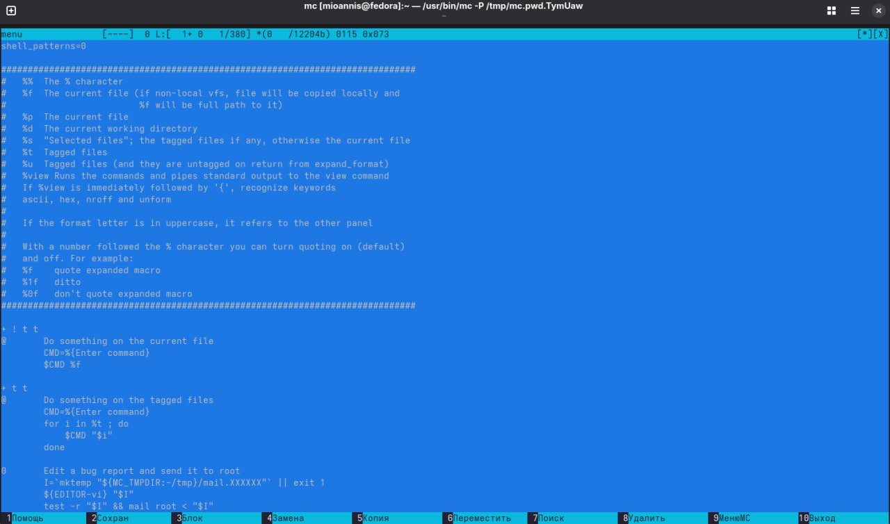{ #fig:010 width=70% }

## 11. анализируем файл расширений.

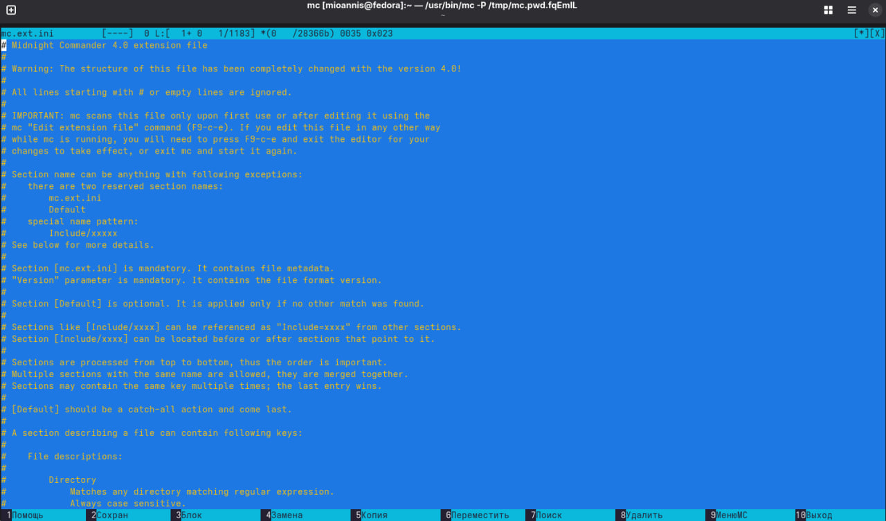{ #fig:011 width=70% }

## 12. Вызовите подменю Настройки. Изучим операции, определяющие структуру экрана mc. Начиная с параметров конфигурации.

{ #fig:012 width=70% }

## 13. Параметры внешнего вида.

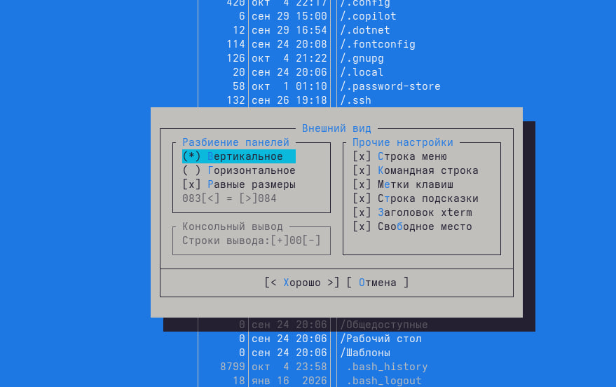{ #fig:013 width=70% }

## 14. Настройки панели (навигация, подсветка файлов, быстрый поиск)

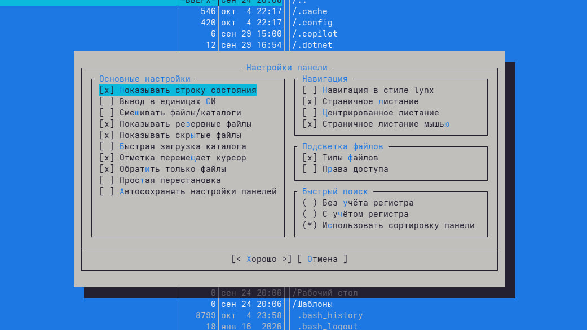{ #fig:014 width=70% }

## 15. Настройки подтвержденя.

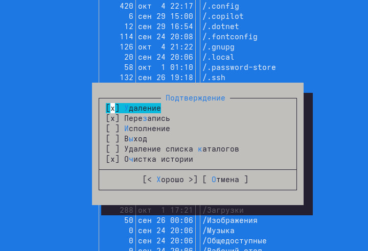{ #fig:015 width=70% }

## 16. Настройки удаления.

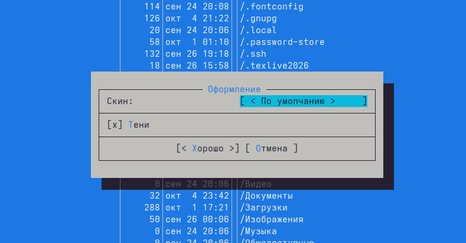{ #fig:016 width=70% }

## 17. Биты символов.

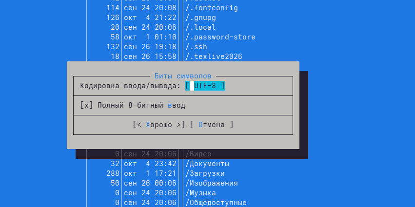{ #fig:017 width=70% }

## 18. Настройки определения клавиш.

{ #fig:018 width=70% }

## 19. Настройки виртуальной файловой системы.

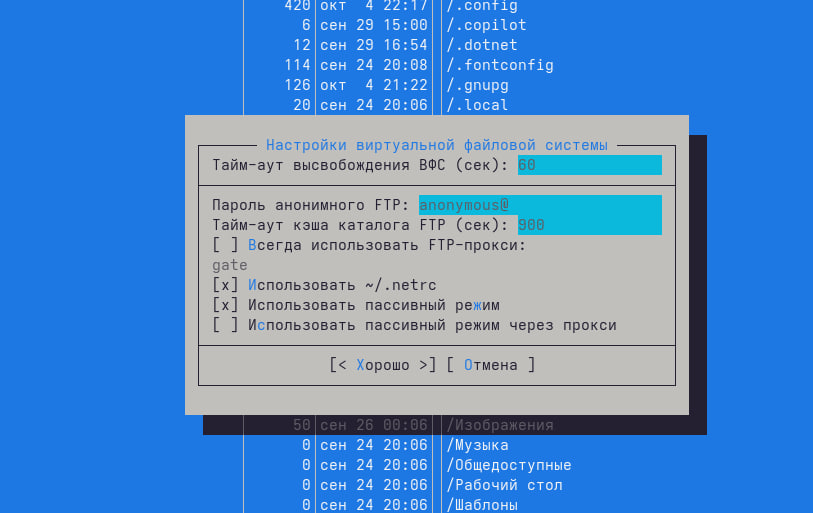{ #fig:019 width=70% }

## 20. Задания по встроенному редактору mc. Создаём файл test.txt и виделяем его.

{ #fig:020 width=70% }

## 21. Добавляем в него текст стихотворения "Тучи" и редактируем его в соответствии с заданием.

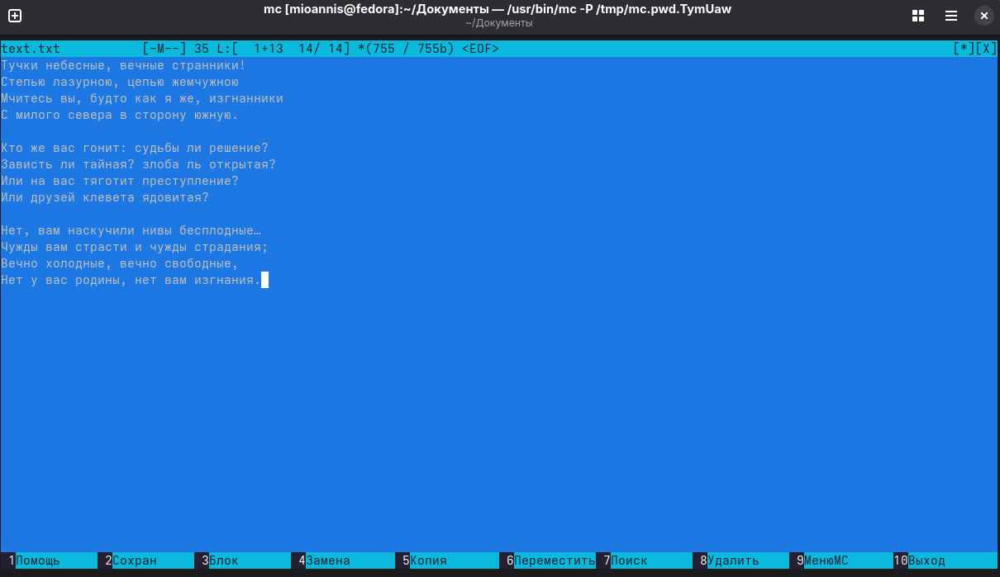{ #fig:021 width=70% }

## 22. Сохраняем изменения не выходя из редактора командой F2.

{ #fig:022 width=70% }

## 23. Отменяем последнее действие командой Ctrl + U

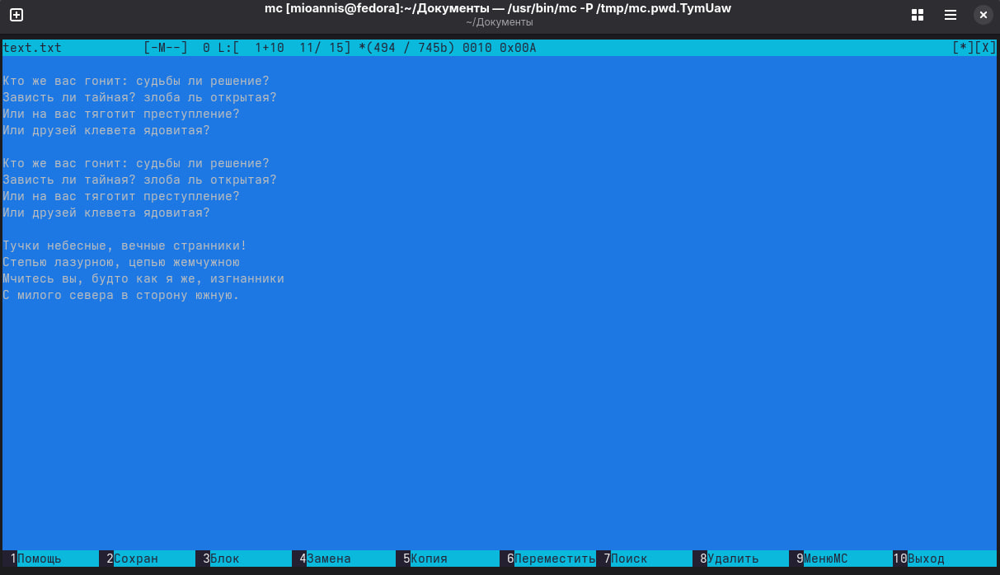{ #fig:023 width=70% }

## 24. Делаем последние правки и сохраняем при выходе.

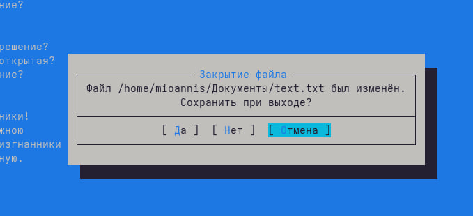{ #fig:024 width=70% }

## 25. Находим файл формата .cpp и открываем его текст (код).

{ #fig:025 width=70% }

## 26. Используя меню редактора, включаем подсветку синтаксиса.

{ #fig:026 width=70% }

# Вывод

В данной работе мы ознакомились с инструментами командной оболочки Midnight Commander. Приобрели навыки практической работы по просмотру каталогов и файлов.
