# Цель работы

Освоение основных возможностей командной оболочки Midnight Commander. Приоб-
ретение навыков практической работы по просмотру каталогов и файлов; манипуляций
с ними.

# Выполнение лабораторной работы

1. Изучим информацию о mc, вызвав в командной строке man mc.

{ #fig:001 width=70% }

2. Запустим из командной строки mc, изучим его структуру и меню.

{ #fig:002 width=70% }

3. Выполним несколько операций в mc, выделяем и копируем файл conf.txt

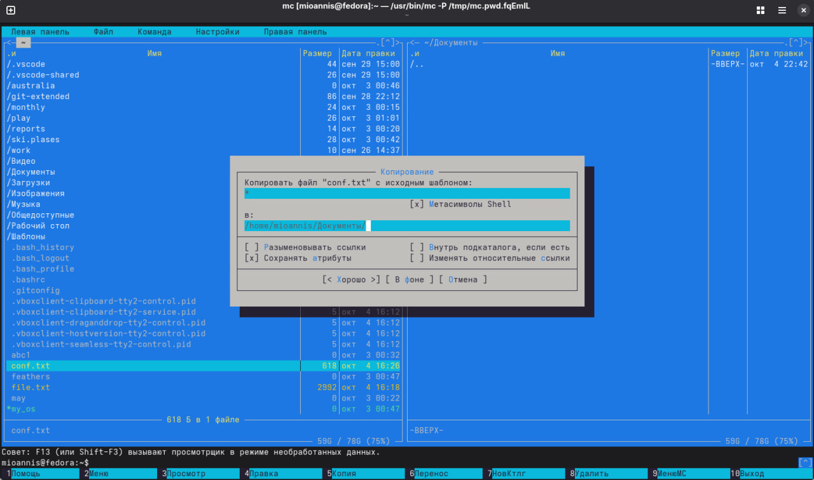{ #fig:003 width=70% }

4. Получаем информацию о размере и правах доступа на файл, оценим степень подробности вывода информации о файлах.

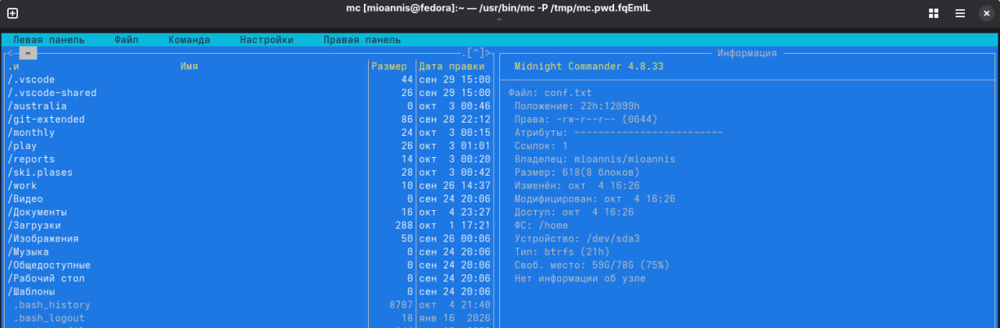{ #fig:004 width=70% }

5. Используя возможности подменю "Файл" просмотрим и изменим содержимое conf.txt, без сохранения

{ #fig:005 width=70% }

6. Создание каталога test dir

{ #fig:006 width=70% }

7. Копируем в него файл feathers

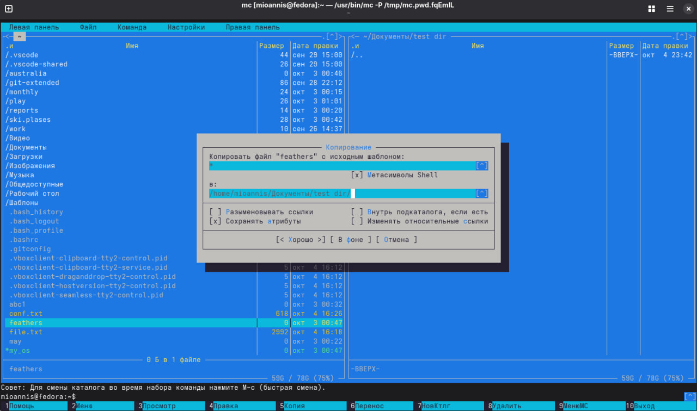{ #fig:007 width=70% }

8. С помощью средств подменю "Команда" ищем файлы .cpp которые содержат строку "main"

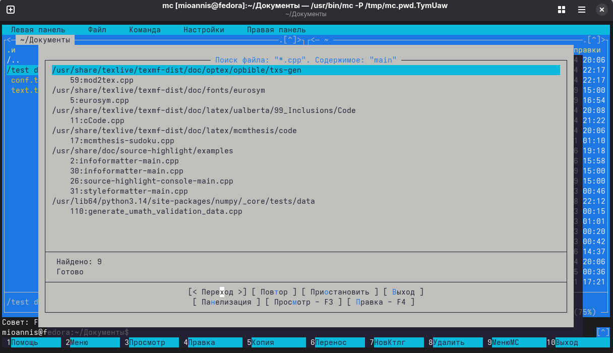{ #fig:008 width=70% }

9. Выбираем из истории команду cd и возвращаемся в домашний каталог.

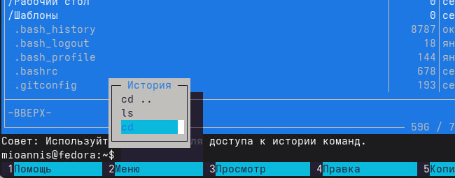{ #fig:009 width=70% }

10. Анализируем файл меню.

{ #fig:010 width=70% }

11. анализируем файл расширений.

{ #fig:011 width=70% }

12. Вызовите подменю Настройки. Изучим операции, определяющие структуру экрана mc. Начиная с параметров конфигурации.

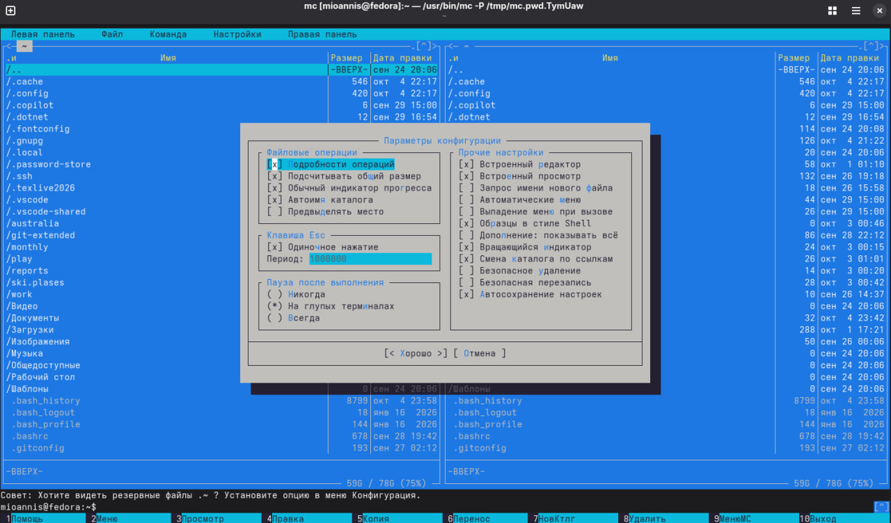{ #fig:012 width=70% }

13. Параметры внешнего вида.

{ #fig:013 width=70% }

14. Настройки панели (навигация, подсветка файлов, быстрый поиск)

{ #fig:014 width=70% }

15. Настройки подтвержденя.

{ #fig:015 width=70% }

16. Настройки удаления.

{ #fig:016 width=70% }

17. Биты символов.

{ #fig:017 width=70% }

18. Настройки определения клавиш.

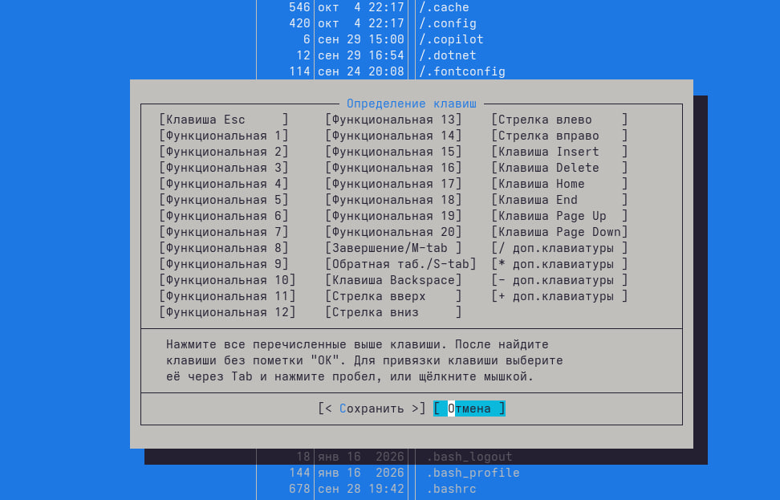{ #fig:018 width=70% }

19. Настройки виртуальной файловой системы.

{ #fig:019 width=70% }

20. Задания по встроенному редактору mc. Создаём файл test.txt и виделяем его.

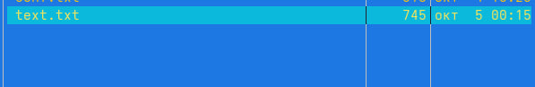{ #fig:020 width=70% }

21. Добавляем в него текст стихотворения "Тучи" и редактируем его в соответствии с заданием.

{ #fig:021 width=70% }

22. Сохраняем изменения не выходя из редактора командой F2.

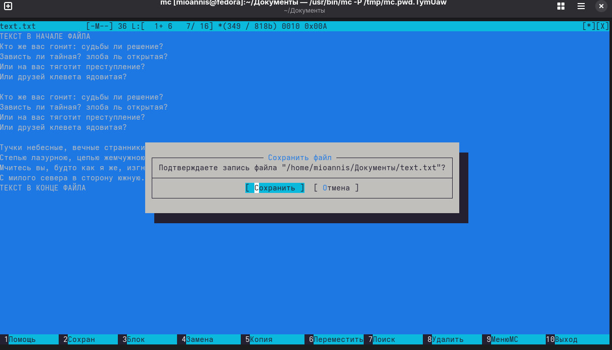{ #fig:022 width=70% }

23. Отменяем последнее действие командой Ctrl + U

{ #fig:023 width=70% }

24. Делаем последние правки и сохраняем при выходе.

{ #fig:024 width=70% }

25. Находим файл формата .cpp и открываем его текст (код).

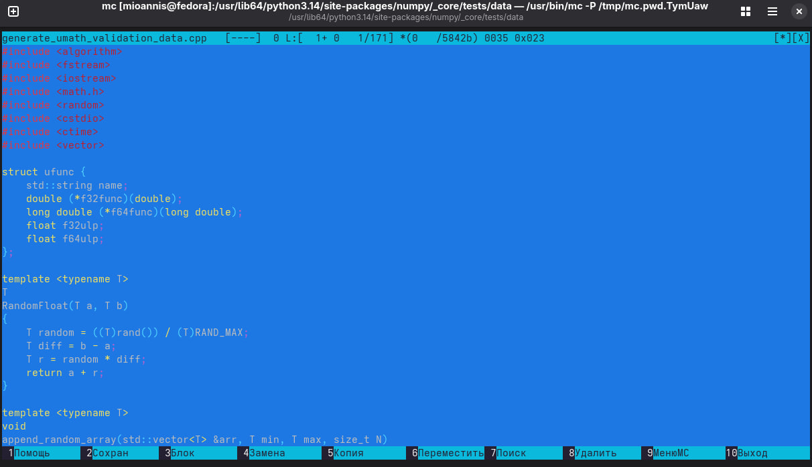{ #fig:025 width=70% }

26. Используя меню редактора, включаем подсветку синтаксиса.

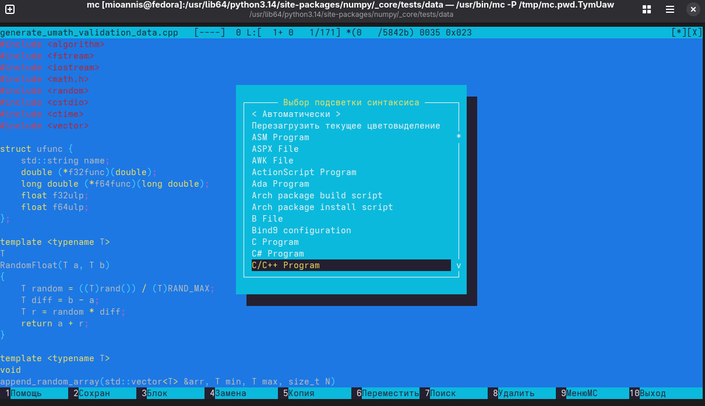{ #fig:026 width=70% }

# Вывод

В данной работе мы ознакомились с инструментами командной оболочки Midnight Commander. Приобрели навыки практической работы по просмотру каталогов и файлов 

##  Контрольные вопросы

1. Какие режимы работы есть в mc? Охарактеризуйте их.
Ответ: В командной оболочке mc есть два режима Информация и Дерево. В режиме Информация на панель выводятся сведения о файле и текущей файловой системе, расположенных на активной панели. В режиме Дерево на одной из панелей выводится структура дерева каталогов. Управлять режимами отображения панелей можно через пункты меню mc

2. Какие операции с файлами можно выполнить как с помощью команд shell, так и с помощью меню mc? Привести несколько примеров.
Ответ: Командные интерпретатор Shell и оболочка Midnight Commander имеют похожую структуру и многие одинаковые команды можно выполнить в обоих оболочках вот некоторые из них
* Системная информация
* Поиск
* Копирование

3. Опишите структуру меню левой панели mc, дайте характеристику командам.
Ответ: Меню левой панели mc представляет собой следующую конструкцию:

Где подпункты меню
* Список файлов показывает файлы в домашнем каталоге.
* Быстрый просмотр позволяет выполнить быстрый просмотр содержимого панели.     
* Информация позволяет посмотреть информацию о файле или каталоге 
* Командная оболочка Midnight Commander В меню каждой (левой или правой) панели можно выбрать Формат списка: стандартный, ускоренный, расширенный  и определённый пользователем.
* Порядок сортировки позволяет задать критерии сортировки при выводе списка файлов и каталогов: без сортировки, по имени, расширенный, время правки, время доступа, время изменения атрибута, размер, узел.

4. Опишите структура меню Файл mc и дайте характеристику командам.
Ответ: Меню Фаил mc представляет собой следующую конструкцию:

Где подпункты меню
* Просмотр ( F3 )  позволяет посмотреть содержимое текущего файла без возможности редактирования. 
* Просмотр вывода команды ( М + ! ) функция запроса команды с параметрами.
* Правка ( F4 ) открывает текущий (или выделенный) файл для его редактирования. 
* Копирование ( F5 ) осуществляет копирование одного или нескольких файлов или каталогов в указанное пользователем во всплывающем окне место. 
* Права доступа ( Ctrl-x c ) позволяет изменить права доступа к одному или нескольким файлам или каталогам.
*  Права доступа на файлы и каталоги 
* Жёсткая ссылка ( Ctrl-x l ) позволяет создать жёсткую ссылку к текущему (или выделенному) файлу1. 
* Символическая ссылка ( Ctrl-x s ) — позволяет создать символическую ссылку к текущему файлу. 
* Владелец группы ( Ctrl-x o ) позволяет задать владельца и имя группы для одного или нескольких файлов или каталогов. 
* Права (расширенные)  позволяет изменить права доступа и владения для одного или нескольких файлов или каталогов. 
* Переименование ( F6 ) позволяет переименовать один или несколько файлов или каталогов.
* Создание каталога ( F7 ) позволяет создать каталог. 
* Удалить ( F8 ) позволяет удалить один или несколько файлов или каталогов. 
* Выход ( F10 )  завершает работу mc. 

5 Опишите структура меню Команда mc, дайте характеристику командам
Ответ: Ответ: Меню Команда mc представляет собой следующую конструкцию:

Где подпункты меню
* Дерево каталогов отображает структуру каталогов системы.
* Поиск файла выполняет поиск файлов по заданным параметрам.  
* Переставить панели меняет местами левую и правую панели. 
* Сравнить каталоги ( Ctrl-x d ) сравнивает содержимое двух каталогов. 
* Размеры каталогов отображает размер и время изменения каталога (по умол- чанию в mc размер каталога корректно не отображается).
* История командной строки выводит на экран список ранее выполненных в оболочке команд. 
* Каталоги быстрого доступа ( Ctrl-\ ) при вызове выполняется быстрая смена текущего каталога на один из заданного списка. 
* Восстановление файлов позволяет восстановить файлы на файловых систе- мах ext2 и ext3. 
* Редактировать файл расширений позволяет задать с помощью определённого синтаксиса действия при запуске файлов с определённым расширением (напри- мер, какое программного обеспечение запускать для открытия или редактирова- ния файлов с расширением .c или .cpp). 
* Редактировать файл меню позволяет отредактировать контекстное меню поль- зователя, вызываемое по клавише F2 . 
* Редактировать файл расцветки имён позволяет подобрать оптимальную для пользователя расцветку имён файлов в зависимости от их типа.

6. Опишите структура меню Настройки mc, дайте характеристику командам
Ответ: Меню Настройки mc представляет собой следующую конструкцию:

Где подпункты меню
* Конфигурация позволяет скорректировать настройки работы с панелями. 
* Внешний вид и Настройки панелей определяет элементы, отображаемые при вызове mc, а также цветовое выделение. 
* Биты символов задаёт формат обработки информации локальным термина- лом. 
* Подтверждение позволяет установить или убрать вывод окна с запросом подтверждения действий при операциях удаления и перезаписи файлов, а также при выходе из программы.
* Распознание клавиш диалоговое окно используется для тестирования функциональных клавиш, клавиш управления курсором и прочее.
* Виртуальные ФС настройки виртуальной файловой системы: тайм-аут, пароль и прочее.

7. Назовите и дайте характеристику встроенным командам mc.
Ответ: В командную оболочку mc встроены стандартные команды. Вот некоторые из них.
* F1 Вызов контекстно-зависимой подсказки.
* F2 Вызов пользовательского меню с возможностью создания and/or.
* F3 Просмотр содержимого файла, на который указывает подсветка в активной панели.
* F4 Вызов встроенного в mc редактора для изменения содержания файла, на который указывает подсветка в активной панели.
* F5 Копирование одного или нескольких файлов, отмеченных в первой (активной) панели, в каталог, отображаемый на второй панели.
* F6 Перенос одного или нескольких файлов, отмеченных в первой панели, в каталог, отображаемый на второй панели.
* F7 Создание подкаталога в каталоге, отображаемом в активной панели.
* F8 Удаление одного или нескольких файлов, отмеченных в первой панели файлов.
* F9 Вызов меню mc.
* F10 Выход из mc.

8 Назовите и дайте характеристику командам встроенного редактора mc.
Ответ: В редактор mc встроено немало команд. Вот некоторые из них.
* Ctrl+y удалить строку.
* Ctrl+u отмена последней операции. 
* Ins вставка/замена.
* F7 поиск.
* Shift+F7 повтор последней операции поиска.
* F4 замена файла.
* F3 первое нажатие начало выделения, второе это окончание выделения.
* F5 копировать выделенный фрагмент F6 переместить выделенный фрагмент.
* F8 удалить выделенный фрагмент.
* F2 записать изменения в файл.
* F10 выйти из редактора.

9. Дайте характеристику средствам mc, которые позволяют создавать меню, определяемые пользователем.
Ответ: Один из четырех форматов списка в Midnight Commander -Пользовательский определённый самим пользователем позволяет ему редактировать меню любого из двух списков. А меню пользователя – это меню, состоящее из команд, определенных пользователем. При вызове меню используется файл ~/.mc.menu. Если такого файла нет, то по умолчанию используется системный файл меню /usr/lib/mc/mc.menu. Все строки в этих файлах  , начинающиеся с пробела или табуляции, являются командами, которые выполняются при выборе записи.

10. Дайте характеристику средствам mc, которые позволяют выполнять действия, определяемые пользователем, над текущим файлом
Ответ: Когда мы выделяем файл не являющегося исполняемым, Midnight Commander сравнивает расширение выбранного файла с расширениями, прописанными в «файле расширений» ~/mc.ext. Если в файле расширений найдется подраздел, задающий процедуры обработки файлов с данным расширением, то обработка файла производится в соответствии с заданными в этом подразделе командами и файлами:
* файл помощи для MC. /usr/lib/mc.hlp
* файл расширений, используемый по умолчанию. /usr/lib/mc/mc.ext
* файл расширений, конфигурации редактора. $HOME/.mc.ext
* системный инициализационный файл. /usr/lib/mc/mc.ini
* файл который содержит основные установки. /usr/lib/mc/mc.lib
* инициализационный файл пользователя. Если он существует, то системный файл mc.ini игнорируется. $HOME/.mc.ini
* этот файл содержит подсказки, отображаемые в нижней части экрана. /usr/lib/mc/mc.hint
* системный файл меню MC, используемый по умолчанию. /usr/lib/mc/mc.menu
* файл меню пользователя. Если он существует, то системный файл меню игнорируется. $HOME/.mc.menu
* инициализационный файл пользователя. Если он существует, то системный файл mc.ini игнорируется. $HOME/.mc.tree