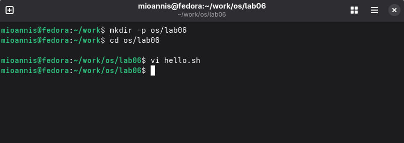
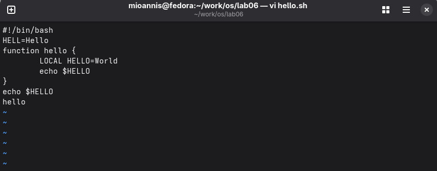
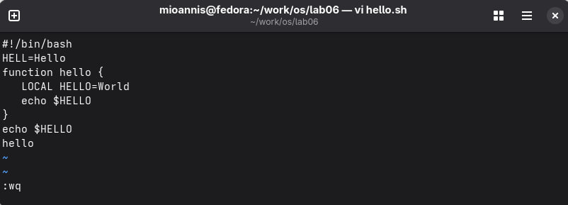
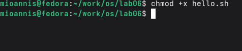
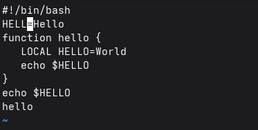
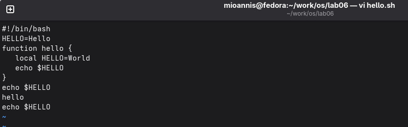
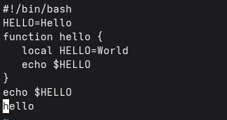
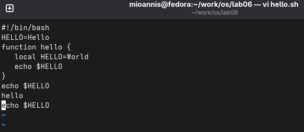

---
## Author
author: 
  name: Магос Иоаннис
  email: 1032240004@rudn.ru
  affiliation:
    - name: Российский университет дружбы народов
      country: Российская Федерация
      postal-code: 117198
      city: Москва
      address: ул. Миклухо-Маклая, д. 6
	  
## Title
title: Презентация по лабораторной работе №10"
subtitle: Текстовой редактор vi
license: CC BY
date: today
date-format: "YYYY-MM-DD"
---

# Цель работы

Познакомиться с операционной системой Linux. Получить практические навыки рабо-
ты с редактором vi, установленным по умолчанию практически во всех дистрибутивах.

# Выполнение лабораторной работы

## 1. Создаём каталог ~/work/os/lab06, переходим в него, создаём файл hello.sh и открываем его в vi.

{ #fig:001 width=70% }

## 2. Нажмите клавишу i и вводим текст скрипта в файл

{ #fig:002 width=70% }

## 3. Нажимаем еsc, затем :wq и Enter, чтобы сохранить добавленный ткест в файл и выйти из редактора.

{ #fig:003 width=70% }

## 4. Даём файлу права на исполнение командой chmod +x hello.sh

{ #fig:004 width=70% }

## 5. Заходим обратно в файл, меняем во второй строке HELL на HELLO и на чётвйртой строке LOCAL на local. Сохраняем.

{ #fig:005 width=70% }

## 6. Ставим курсор на последнюю строку и добавляем строку echo $HELLO.

{ #fig:006 width=70% }

## 7. Переходим обратно в режим команд и используя "dd" удаляем строку.

{ #fig:007 width=70% }

## 8. Далее отменяем последнее действие командой "u" и сохраняем изменения в файле при выходе командой ":wq".

{ #fig:008 width=70% }

# Вывод

 В ходе роботы мы  познакомились с операционной системой Linux, и получили практические навыки работы с редактором vi, установленным по умолчанию практически во всех дистрибутивах UNIX. А также освоили основные режимы и команды.