# Цель работы

Получить практические навыки работы с редактором Emacs.

# Выполнение лабораторной работы

1. Открываем emacs

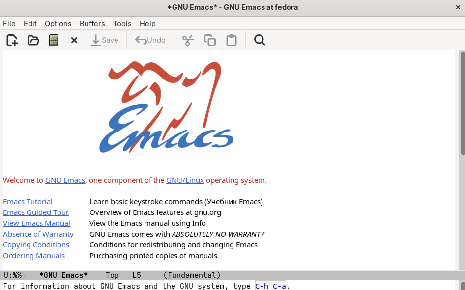{ #fig:001 width=70% }

2. Создаем файл lab07.sh с помощью комбинации Ctrl-x Ctrl-f и добавляем в него текст.

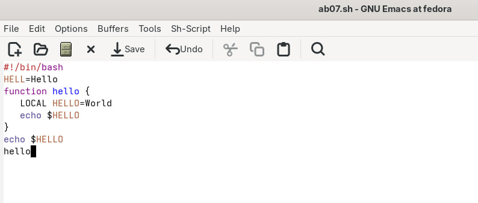{ #fig:002 width=70% }

3. Сохраняем файл с помощью комбинации Ctrl-x Ctrl-s 

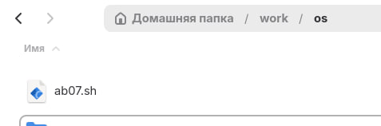{ #fig:003 width=70% }

4. При помощи команд вырезаем одну строку и вставляем её в конец файла.

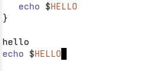{ #fig:004 width=70% }

5. Выделяем и копируем в буфер обмена область текста.

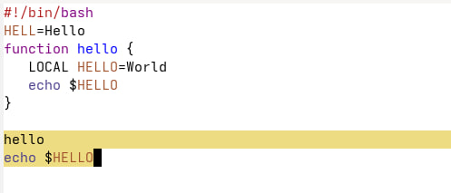{ #fig:005 width=70% }

6. Вставляем область в конец файла, вырезаем ту же область и отменяем последнее действие.

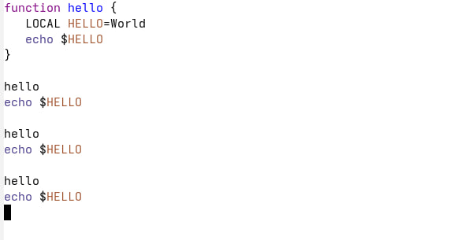{ #fig:006 width=70% }

7. Учимся использовать команды по перемещению курсора.

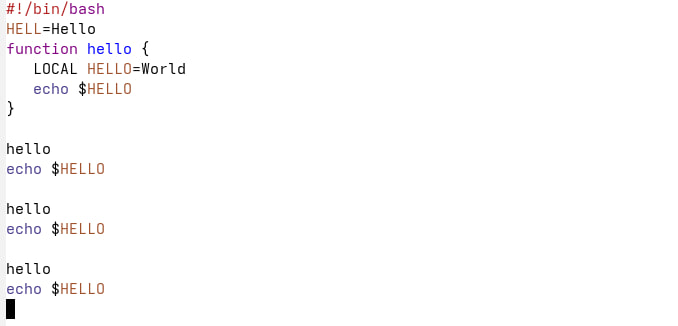{ #fig:007 width=70% }

8. Выводим список активных буферов на экран.

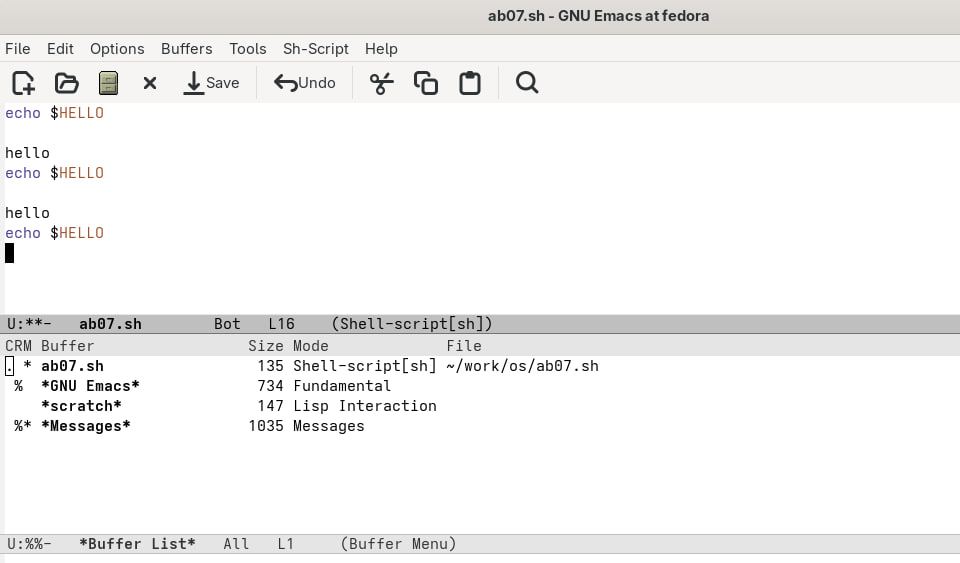{ #fig:008 width=70% }

9. Перемещаемся в окно со списком открытых буферов и переключаемся на другой буфер.

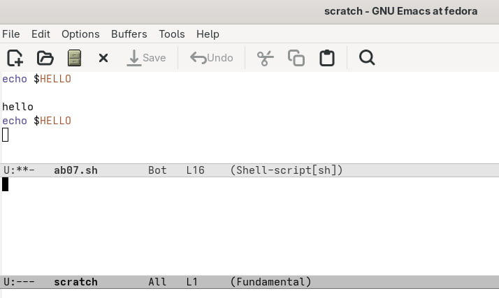{ #fig:009 width=70% }

10. Закрываем окно на C-x 0 и используя C-x b возврацаемся в окно с файлом lab07.sh

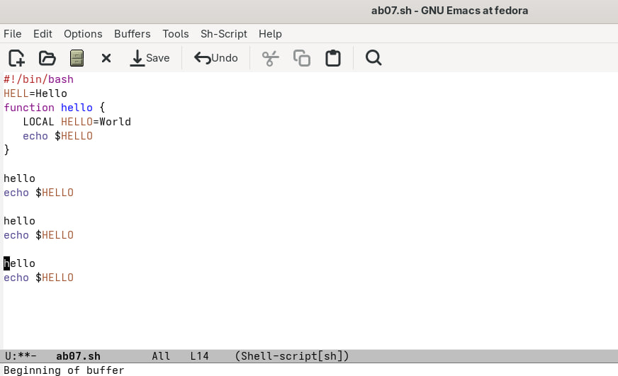{ #fig:010 width=70% }

11. Используя команды C-x 3 и C-x 2 делим фрейм на 4 окна.

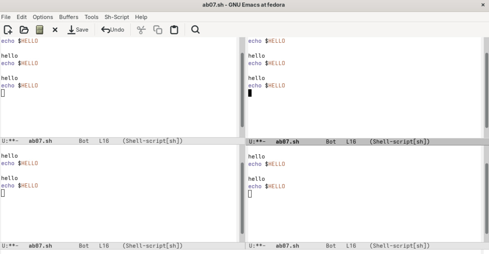{ #fig:011 width=70% }

12. В каждом создаём новый буфер в виде файла .txt со своим текстом.

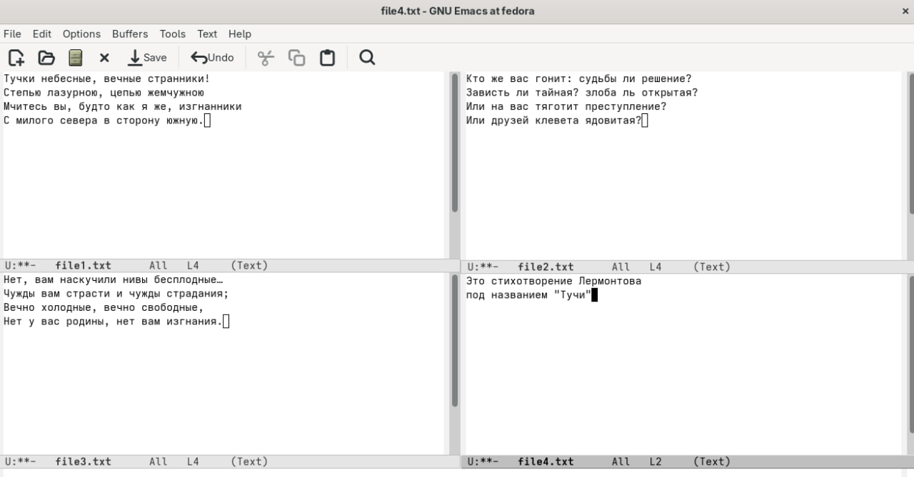{ #fig:012 width=70% }

13. Используя режим поиска C-s находим в первом буфере все символы "и", перемещаемся по ним той же командой.

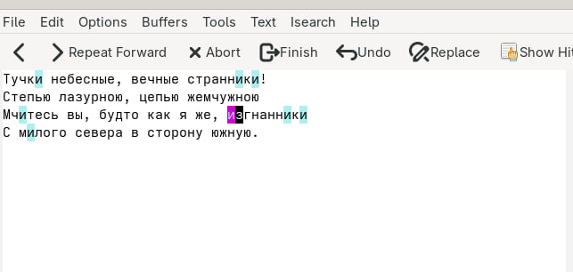{ #fig:013 width=70% }

14. В режиме поиска и замены (M-%) меняем строку "цепью" на "НИТЬЮ".

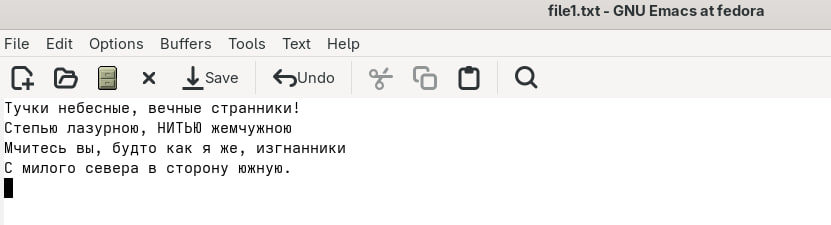{ #fig:014 width=70% }

15. Далее используе режим обычного поиска (M-s + o) и находим символ ","

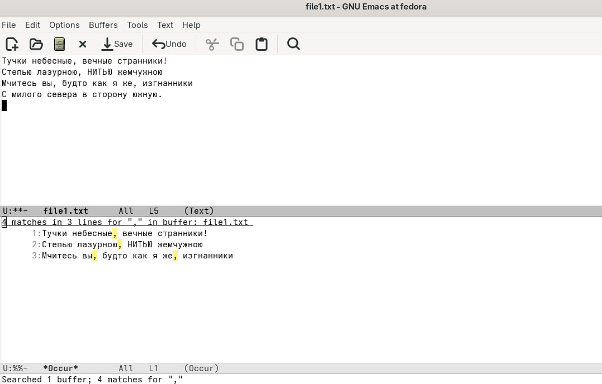{ #fig:015 width=70% }

# Вывод

 В данной работе мы познакомились с еще одним редактором операционной системой Linux. Получили практические навыки работы с редактором Emacs.

# Контрольные вопросы

1. Кратко охарактеризуйте редактор emacs. 
Ответ: Emacs представляет собой мощный экранный редактор текста, написанный на языке высокого уровня Elisp. 

2. Какие особенности данного редактора могут сделать его сложным для освоения новичком? 
Ответ: Сложным освоение данной программы для новичка  может сделать незнание комбинации клавиш или английского. 

3. Своими словами опишите, что такое буфер и окно в терминологии emacs’а 
Ответ: Моими словами буфер это динамическая память, а окно- то, что мы видим 

4. Можно ли открыть больше 10 буферов в одном окне? 
Ответ: Можно если нет ограничений на систему. 

5. Какие буферы создаются по умолчанию при запуске emacs? 
Ответ: Буферы, которые открываются по умолчанию: GNU Emacs, scratch, Messages, Quail Completions 

6. Какие клавиши вы нажмёте, чтобы ввести следующую комбинацию C-c | и C-c C-|? 
Ответ: Сtrl+c, Shift+\ и Ctrl+c Ctrl+\ 

7. . Как поделить текущее окно на две части? 
Ответ: Нажать   C-x 3, или  C-x 2. 

8. В каком файле хранятся настройки редактора emacs? 
Ответ: Настройки хранятся в файле ~/.emacs. 

9. Какую функцию выполняет клавиша Backspace и можно ли её переназначить? 
Ответ: Перемещение курсора 

10. Какой редактор вам показался удобнее в работе vi или emacs? Поясните почему. 
Ответ: Редактор emacs ,потому что на нем можно работать сразу с несколькими файлами. 
