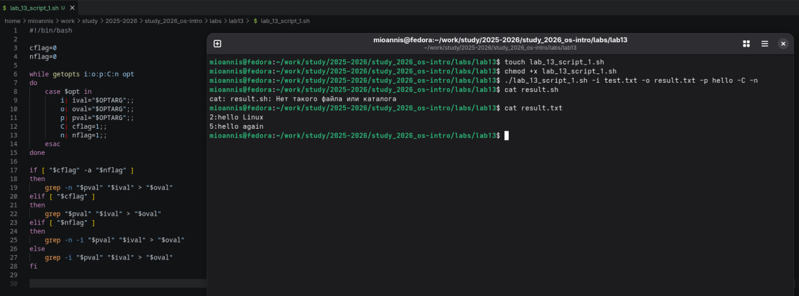
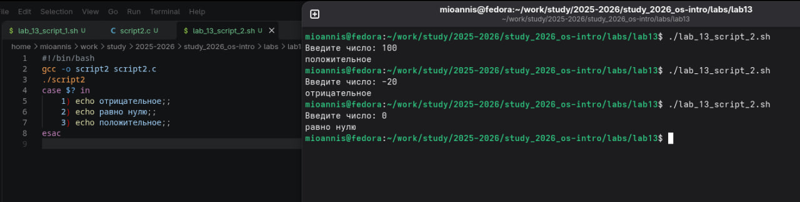
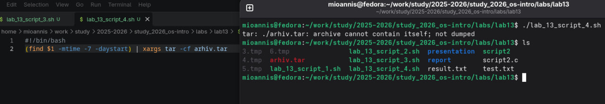

---
## Author
author: 
  name: Магос Иоаннис
  email: 1032240004@rudn.ru
  affiliation:
    - name: Российский университет дружбы народов
      country: Российская Федерация
      postal-code: 117198
      city: Москва
      address: ул. Миклухо-Маклая, д. 6
	  
## Title
title: Презентация по лабораторной работе №13"
subtitle: Программирование в командном процессоре ОС UNIX. Ветвления и циклы
license: CC BY
date: today
date-format: "YYYY-MM-DD"
---

# Цель работы
Изучить основы программирования в оболочке ОС UNIX. Научится писать более
сложные командные файлы с использованием логических управляющих конструкций
и циклов.

# Выполнение лабораторной работы

## 1. Выполняем первую задачу:
Используя команды getopts grep, написать командный файл, который анализирует командную строку с ключами (список ниже), а затем ищет в указанном файле нужные строки, определяемые ключом -p.

* -iinputfile — прочитать данные из указанного файла;
* -ooutputfile — вывести данные в указанный файл;
* -pшаблон — указать шаблон для поиска;
* -C — различать большие и малые буквы;
* -n — выдавать номера строк.

--- 

{ #fig:001 width=70% }

## 2. Выполняем вторую задачу:
* Написать на языке Си программу, которая вводит число и определяет, является ли оно больше нуля, меньше нуля или равно нулю. Затем программа завершается с помощью функции exit(n), передавая информацию в о коде завершения в оболочку. Командный файл должен вызывать эту программу и, проанализировав с помощью команды $?, выдать сообщение о том, какое число было введено.

{ #fig:002 width=70% }

## 3. Выполняем третью задачу:
* Написать командный файл, создающий указанное число файлов, пронумерованных последовательно от 1 до 𝑁 (например 1.tmp, 2.tmp, 3.tmp,4.tmp и т.д.). Число файлов, которые необходимо создать, передаётся в аргументы командной строки. Этот же командный файл должен уметь удалять все созданные им файлы (если они существуют).

{ #fig:003 width=70% }

## 4. Выполняем четвёртую задачу:
* Написать командный файл, который с помощью команды tar запаковывает в архив все файлы в указанной директории. Модифицировать его так, чтобы запаковывались только те файлы, которые были изменены менее недели тому назад (использовать команду find).

{ #fig:004 width=70% }

# Вывод

В данной работе мы изучили основы программирования в оболочке ОС UNIX и писать более сложные командные файлы с использованием логических управляющих конструкций и циклов. 
