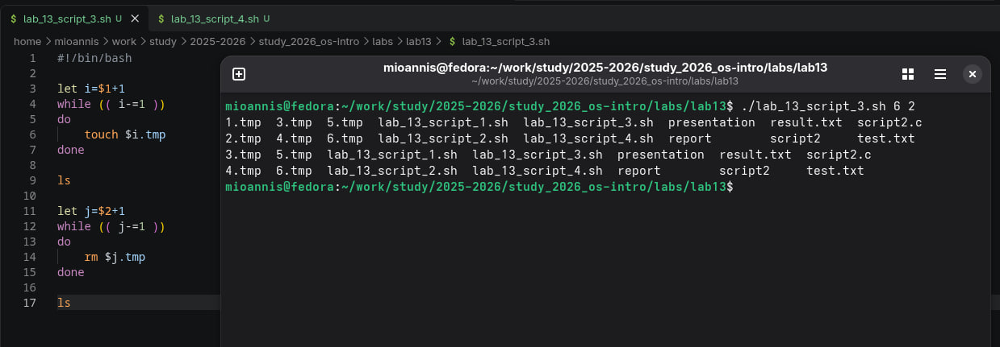

# Цель работы
Изучить основы программирования в оболочке ОС UNIX. Научится писать более
сложные командные файлы с использованием логических управляющих конструкций
и циклов.

# Выполнение лабораторной работы

1. Выполняем первую задачу:
Используя команды getopts grep, написать командный файл, который анализирует командную строку с ключами:
* -iinputfile — прочитать данные из указанного файла;
* -ooutputfile — вывести данные в указанный файл;
* -pшаблон — указать шаблон для поиска;
* -C — различать большие и малые буквы;
* -n — выдавать номера строк.
а затем ищет в указанном файле нужные строки, определяемые ключом -p.

{ #fig:001 width=70% }

2. Выполняем вторую задачу:
* Написать на языке Си программу, которая вводит число и определяет, является ли оно больше нуля, меньше нуля или равно нулю. Затем программа завершается с помощью функции exit(n), передавая информацию в о коде завершения в оболочку. Командный файл должен вызывать эту программу и, проанализировав с помощью команды $?, выдать сообщение о том, какое число было введено.

{ #fig:002 width=70% }

3. Выполняем третью задачу:
* Написать командный файл, создающий указанное число файлов, пронумерованных последовательно от 1 до 𝑁 (например 1.tmp, 2.tmp, 3.tmp,4.tmp и т.д.). Число файлов, которые необходимо создать, передаётся в аргументы командной строки. Этот же командный файл должен уметь удалять все созданные им файлы (если они существуют).

{ #fig:003 width=70% }

4. Выполняем четвёртую задачу:
* Написать командный файл, который с помощью команды tar запаковывает в архив все файлы в указанной директории. Модифицировать его так, чтобы запаковывались только те файлы, которые были изменены менее недели тому назад (использовать команду find).

{ #fig:004 width=70% }

# Вывод

В данной работе мы изучили основы программирования в оболочке ОС UNIX и писать более сложные командные файлы с использованием логических управляющих конструкций и циклов. 

## Контрольные вопросы

1. Каково предназначение команды getopts? 
Ответ: Создание по пользовательским аргументам.
 
2. Какое отношение метасимволы имеют к генерации имён файлов? 
Ответ: Используют как файлы так и аргументы. 

3. Какие операторы управления действиями вы знаете? 
Ответ: If, else, elif, fi, while, do, done, until, do, done, for, in, do, done, case, in, esac 

4. Какие операторы используются для прерывания цикла? 
Ответ:  
* for – будет выполнять действие до тех пор, пока есть объекты для выполнения. 
* while – выполняет действие до тех пор, пока условие является истинным.  
* until – будет выполнятся пока условие не станет правдиво. 

5. Для чего нужны команды false и true? 
Ответ: until – будет выполняться до тех пор, пока условие не станет true, т.е. пока оно не станет false. 

6. Что означает строка if test -f man$s/$i.$s, встреченная в командном файле? 
Ответ: Проверяет если существует файл его размерность и тип c двумя разными расширениями, заменяя через переменные. 

7. Объясните различия между конструкциями while и until. 
Ответ:  
* while – выполняет действие до тех пор, пока условие является истинным.  
* until – будет выполняться до тех пор, пока условие не станет истинным, т.е. пока оно false. 